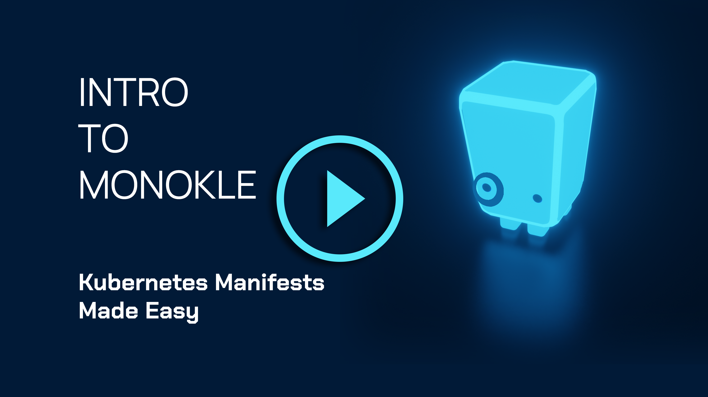
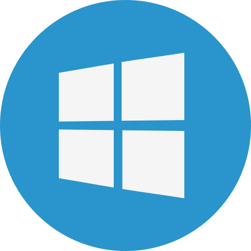

  
  

  <a href="https://monokle.io">Website</a> |
  <a href="https://kubeshop.github.io/monokle/">Documentation</a> |
  <a href="https://discord.gg/uNuhy6GDyn">Discord</a> |
  <a href="https://kubeshop.io/blog">Blog</a>

  Welcome to Monokle 🧐 - your friendly desktop UI for managing k8s manifests!

  
  
  
  
  

  <a href="https://www.youtube.com/watch?v=wkFWg_S8eUA">
    
    
Click on the image or this link to watch the "Intro to Monokle" short video (3 mins)

  </a>

## Core Features

- ⚡ Quickly get a high-level view of your manifests, their contained resources and relationships
- 🖊️ Easily edit resources without having to learn or look up yaml syntax
- 🔨 Refactor resources with maintained integrity of names and references
- 📷 Preview and debug resources generated with kustomize or helm
- 🤝 Diff resources against your cluster and apply changes immediately
- 📚 Create multi-step forms using Monokle's templating system to quickly generate manifests
- 💡 And much more, check out the [Documentation](https://kubeshop.github.io/monokle/)

Read the [Feature Overview](https://kubeshop.github.io/monokle/features/) document or the [introductory blog-post](https://medium.com/kubeshop-i/hello-monokle-83ecb42f5d96) to get a quick intro and overview.

Read about the [latest 1.7.0 release](https://kubeshop.io/blog/monokle-1-7-0-release).

## Download & Install

<table>
  <tr>
    <td>Windows</td>
    <td>macOS</td>
    <td>Linux</td>
  </tr>
  <tr>
    <td>
      

        

      

    </td>
    <td>
      

        
      

    </td>
    <td>
      

        
      

    </td>
  </tr>
  <tr>
    <td>
      <a href="https://github.com/kubeshop/monokle/releases/download/downloads/Monokle-win-x64.exe">Download .exe</a>
    </td>
    <td>
      <a href="https://github.com/kubeshop/monokle/releases/download/downloads/Monokle-mac-universal.dmg">Download .dmg</a>
    </td>
    <td>
      <a href="https://github.com/kubeshop/monokle/releases/download/downloads/Monokle-linux-x86_64.AppImage">Download .appImage</a>
    </td>
  </tr>
</table>

## Roadmap

There is a lot of functionality currently being considered:

- Creation of resources/projects - see [Resource creation/manipulation](https://github.com/kubeshop/monokle/projects/4).
- Improved Cluster functionality - see [Cluster integration](https://github.com/kubeshop/monokle/projects/8).
- Plugin/extension mechanism - see [Extension mechanism for plugins](https://github.com/kubeshop/monokle/issues/177).
- Improved resource filtering/navigation - see [Resource Navigation](https://github.com/kubeshop/monokle/projects/2).
- Improved Helm integration - see [Helm integration](https://github.com/kubeshop/monokle/projects/12).

Don't hesitate to provide any feedback you might have to help us prioritize and improve our backlog!

## Getting involved

- Share ideas, suggestions, bug-reports or complaints on our [Discord server](https://discord.gg/uNuhy6GDyn).
- Read about how to contribute [in our Documentation](https://kubeshop.github.io/monokle/contributing).
