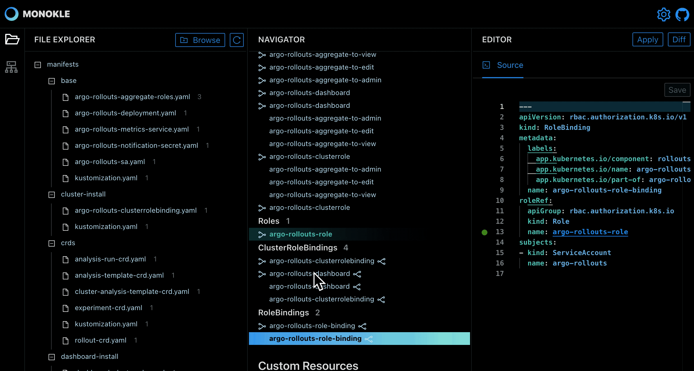

# Monokle

Welcome to Monokle - your friendly desktop UI for managing k8s manifests!

[Hello Monokle Video]

## Features

### Navigate k8s objects easily


### Follow links up or downstream through your manifests


### Preview the resources created by kustomizations


### Locate source file quickly, and see if links are dead-ends



## Getting Started

Either download an (as of yet unsigned) installer from [releases](https://github.com/kubeshop/monokle/releases) or
clone/build as described below!

- Check out the [monokle.io website](https://monokle.io) for introductory material and videos.
- Read the [introductory blog-post](https://medium.com/@kubeshop/introducing-monokle) to get a quick intro and overview
- Ask question, report bugs, suggest features, join our discussions
  [here on GitHub](https://github.com/kubeshop/monokle/discussions)

## Building

Clone this repo and build with

```
nvm install
npm install --force
```

run with

```
npm run electron:dev
```

The Electron app will reload if you make edits in the `electron` directory.<br> You will also see any lint errors in the
console.

Use

```
npm run electron:build
```

to build the Electron app package for production to the `dist` folder.

This project was bootstrapped from
https://github.com/yhirose/react-typescript-electron-sample-with-create-react-app-and-electron-builder, which provides

- TypeScript supports for Electron main process source code
- Hot-relaod support for Electron app
- Electron Builder support

See https://www.electron.build/ for more info on the electron builder

## Components used

- https://github.com/eemeli/yaml for yaml parsing
- https://github.com/react-monaco-editor/react-monaco-editor for source editing
- https://github.com/micromatch/micromatch for dynamic filtering in navigator and file exclusion matching
- https://github.com/JSONPath-Plus/JSONPath for finding refs/selectors in resources
- https://github.com/rjsf-team/react-jsonschema-form for generating forms for k8s resources
- https://github.com/wbkd/react-flow for graph diagrams
- https://github.com/tweenjs/es6-tween for animation tweening
- https://github.com/pengx17/monaco-yaml for yaml support in the source editor
- https://github.com/paulmillr/chokidar for file watching
- https://github.com/ant-design/ant-design/ for UI
- https://github.com/styled-components/styled-components for custom styling

## Dev Dependencies

- https://github.com/gsoft-inc/craco for overriding CRA config for folder aliases, see
  https://www.npmjs.com/package/craco-alias#examples
