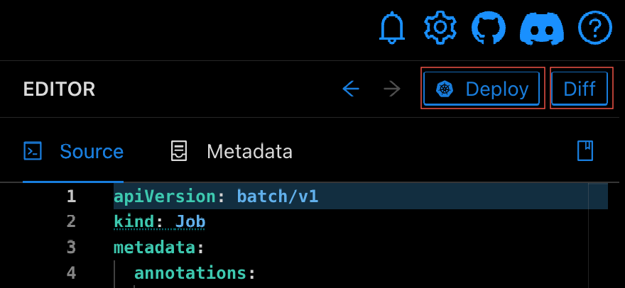

# Deploying and Diffing Resources

When a resource is selected in the navigator, the Editor contains **Deploy** and **Diff** buttons in the top right.

- Selecting **Deploy** will deploy the selected resource to the currently configured Cluster. A status message will be
  shown in the top right after deploying.
- Selecting **Diff** will diff the selected resource against the currently configured cluster;
    - If the resource does not exist in the cluster, an error will be shown.
    - If the resource _does_ exist, the Diff dialog will be shown.

In this screenshot

- The left side shows the resource in Monokle.
- The right side shows the resource retrieved from the cluster.
- Differences are highlighted as shown.

Refreshing the diff is done with the **Refresh** button and deploying your local version of the resource to your cluster is done with **Deploy**.

## **Editing a Resource in Cluster Mode**

Monokle allows you to edit any resource viewed in [Cluster Mode](cluster-integration.md) and use the **Deploy** button to apply those changes back
to the cluster. This immediately applies "hot fixes" to your cluster during browsing.

## **Deploy Resource Changes to Cluster**

After editing a resource in Monokle, click the **Diff** button:

 The following modal appears for selecting the namesapce for deployment:

Select an existing namespace from the cluster, create a new namespace, or don't specify a namespace, which will deploy into namespaces already declared in the resource.
