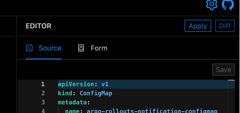
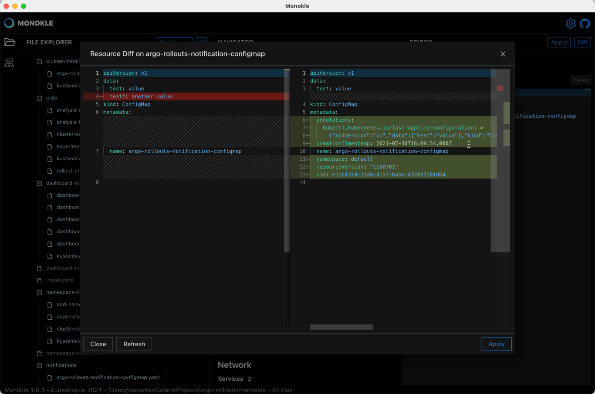

# Applying and Diffing Resources

At any time when a resource is selected in the Navigator the Editor contains "Apply" and "Diff" buttons in the top right.

- Selecting "Apply" will prompt if to apply the selected resource to the currently configured Cluster. A status message will be
  shown in the top right after applying.
- Selecting "Diff" will diff the selected resource against the currently configured cluster;
    - if the resource does not exist in the cluster an error will be shown
    - if the resource _does_ exist a Diff dialog will be shown:

In this screenshot

- the left shows the resource in Monokle
- the right shows the resource retrieved from the cluster
- differences are highlighted as shown in the screenshot

Refreshing the diff is done with the "Refresh" button, applying your local version of the resource to your cluster is done with "Apply" (!).

## Editing resource in Cluster Mode

Monokle allows you to edit any resource viewed in [Cluster mode](cluster-integration.md) and use the Apply button to apply those changes back
to the cluster - for immediately applying "hot fixes" to your cluster during browsing.
