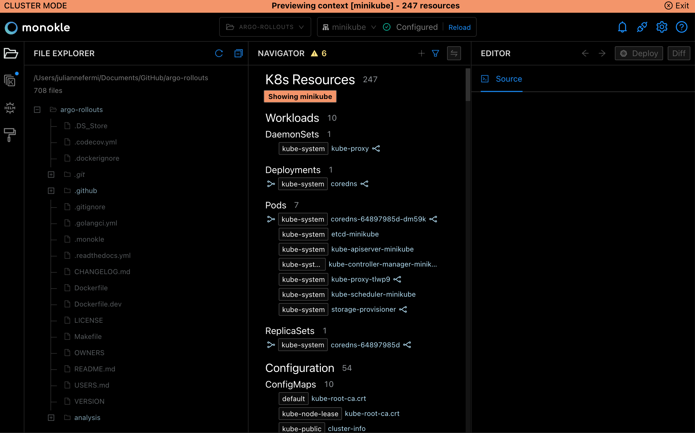

# Cluster Integration

Although Monokle is mainly geared toward working with manifest files, it also has the capability to connect 
to a cluster and show all contained resources, providing a convenient and easy way to inspect cluster resources.

Monokle will automatically detect the default Kubeconfig file or it can be declared in Settings:

## **Using the Cluster Selector**

Choose a cluster to work with by using the Cluster Selector:

If the Cluster Selector does not appear, ensure that the **Show Cluster Selector** option is checked in the Settings menu:

Selecting the **Load** button will attempt to populate the Resource Navigator with objects from the configured cluster:

Monokle is now in **Cluster Mode** (as indicated by the header at the top):

- The File Explorer has been disabled if a folder had been previously selected.
- The Navigator contains all resources retrieved from the configured cluster:
  - Resource navigation works as with files; selecting a resource shows its content in the source editor.
  - Resource links are shown as before with corresponding popups/links/etc.
- Selecting **Exit** in the top right restores the contents of the Resource Navigator to the currently selected folder.

## **Working with Multiple Resources**

In the Navigator, hover over a local resource to display a check box to select one or more resources:

Selecting one or more resources brings up the **Action Links** at the top of the Navigator where the **Delete** and **Deploy** options are available:

This same functionality is available for cluster resources where the **Delete** and **Save to file/folder** are the options:

