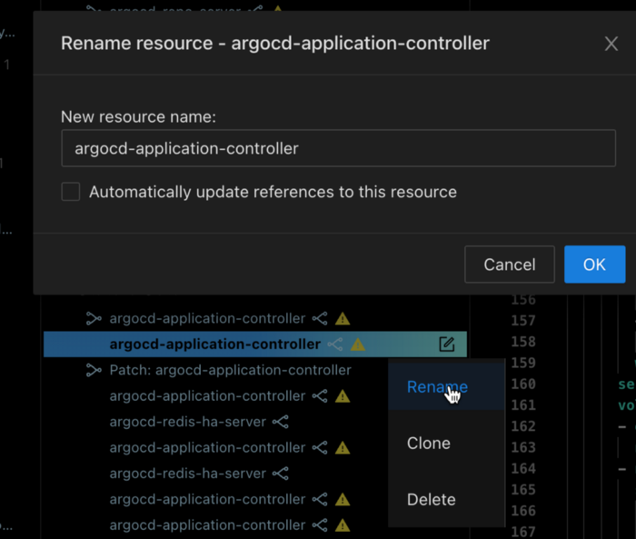
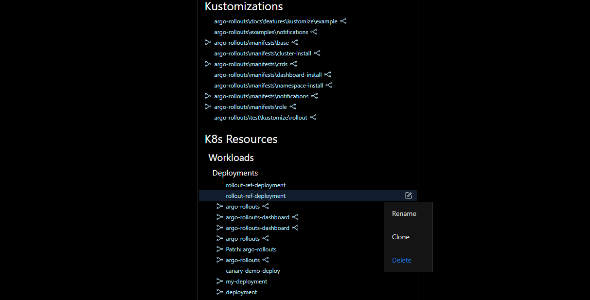

# Creating Resources

## **Add a Resource**

While using Monokle, you can directly add new K8s resources. Once you have browsed and added your project folder, click on the **New Resource** button at the top of the navigator to launch the **Add New Resource** dialog.

For adding resources to new or existing files in the navigator, click on the Save button at the top-right corner of the interface.

While creating a resource, it is possible to select an existing resource as a template from the drop-down menu. 

## **Create a Resource from a Template**

Monokle allows the use of templates to start a new project via the **Start from a template** option:

The **Create a Project from a Template** dialog appears:

Name your project, select its location and click **Next: Select a Template**.

Monokle includes a default set of templates which are installed automatically when starting Monokle
for the first time and available in the Templates Explorer when working with your Monokle projects:

Check out the [Monokle Default Templates Plugin](https://github.com/kubeshop/monokle-default-templates-plugin) repository to 
see the complete list of templates that are included along with their corresponding schemas and manifests.

## **Navigator Resource Options**

Click the ellipsis to the right of a resource name to see the options available:

### **Rename a Resource**

You can rename resources and update all the references associated with that resource to ensure the integrity of that link.

### **Clone a Resource**

You can use the Clone action to create a new resource by using existing resources as a template. 

### **Delete a Resource**

You can use the Delete action in the cluster mode to delete the resource from the actual cluster. 

