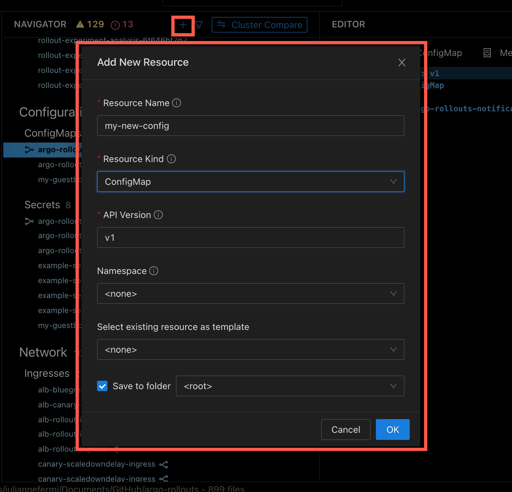

# Creating Resources

While using Monokle, you can directly add new K8s resources. Once you have browsed and added your project folder, click on the “New Resource” button at the top of the navigator to launch the “Add New Resource” dialog.

For adding resources to new or existing files in the navigator, click on the Save button at the top-right corner of the interface.

While creating a resource, it is possible to select an existing resource as a template from the drop-down menu. 

