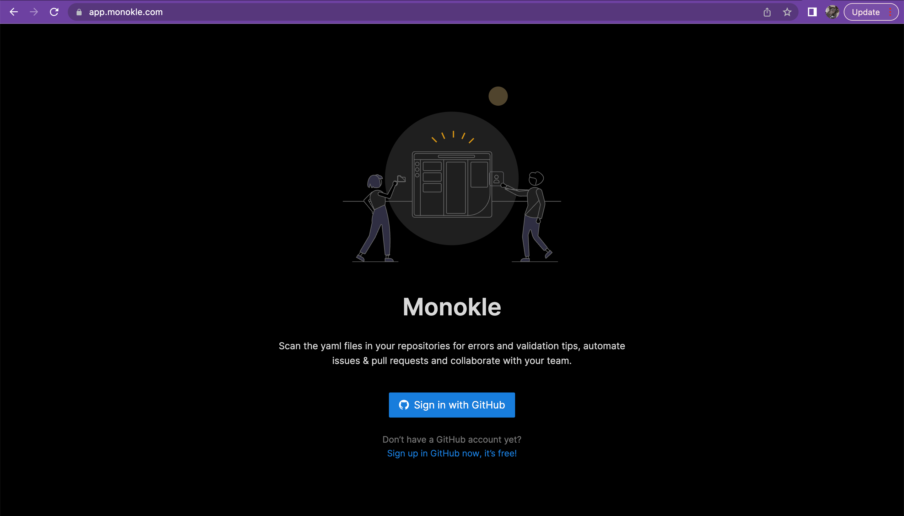

# Using Monokle Desktop and Monokle Cloud

Monokle is available via both a locally installed desktop version and a cloud version to use without having to install in your environment. Monokle also includes a CLI and GitHub action that can be used to integrate in your development workflow.

## **Monokle Desktop**

**Monokle Desktop** is for engineers that create and maintain high-quality Kubernetes Deployments.

The desktop version focuses on enabling anybody to manage manifests and configuration independently of their knowledge level, before and after deployment, with specific features for creation of content easily through templates and snippets for single developers and platform engineers.

To start working with Monokle Desktop, please follow this [Getting Started](getting-started.md) guide 🚀</em>.

## **Monokle Cloud**

**Monokle Cloud** is for teams managing and validating their Kubernetes deployments in Git.

Monokle Cloud focuses on configuration visibility and policy enforcing. It helps to improve the security of the deployments in GitOps adding information about resources and policies applicable, making it easier to make decisions about whether to merge or not a PR, through the use of linters, policies and RBAC into the PR process and allowing collaboration.

To access Monokle in the cloud, please visit https://app.monokle.com/ to get started.

## **Comparing Version Functionality**

### **Data Sources**

In Monokle Desktop, the following data sources are accessible:

- Local folders
- Git repos
- Clusters

The following sources will be added soon:

- Helm repos
- Images repos

Use Monokle Cloud to work directly with GitHub Repos and Kustomize.

### **Exploring Resources**

Both the Desktop and Cloud versions of Monokle offer the following ways to explore resources:

- Show files
- Resource included in manifests
- Understand links between artifacts
- Graph view*
- CRD processing 
- Helm values & Kustomize overlays processing

### **Editing Resources**

Use Monokle Desktop to:

- Create and edit manifests.
- Use templates and code generators.
- Reuse templates bundled with the product or create your own.
- Automatically fix config errors.
- Create your own policies.*

Creating your own policies is also a feature of Monokle Cloud.

### **Visualize Resources**

Both Monokle Desktop and Monokle Cloud allow you to: 

- Show schema errors inline. 
- Previsualize Helm charts.
- Preview Kustomizations. 

Monokle Desktop also has the capability to ***Preview Shell Commands***.

### **Check Resources**

You can also use both products to:

- Check against specific K8s schemas. 
- Visualize broken links. 
- Check the results of OPA policies.  

Plans for future checking functionalities in both Desktop and Cloud include: ***Results of other policies (Kyberno)*** and ***Define your own policies***.

### **Compare Resources**

Monokle has robust compare features for almost any resource. Compare ***Files, Folders, Helm Output, Kustomize Output, Configurations, Git Branches*** and ***Commits*** with both Desktop and Cloud.

With Desktop, compare ***Configurations, Clusters*** and ***Shell Command Output***.

### **Collaboration**

Collaborate on the following with Monokle Cloud:

- Group management. Create your own users and groups with access to the resources.
- Role-based access control (RBAC). Define what resources can be modified in your PR.*
- Quick sharing of URL of resources, errors in LoC, previews, comparisons, etc.
- Define and enforce company policies.

Collaborate on ***Personal Shareable Policies*** with both versions of Monokle.

### **Publish**

Easily publish changes with Monokle Desktop and Monokle Cloud:

- Create a new branch or a new commit with changes.
- Synchronize with remote git servers.
- Create, visualize and manage pull requests.*

In Monokle Desktop you can also ***Modify local files*** and ***Clusters***.

Create GitHub issues for errors (in-line) in Monokle Cloud.

## **Get in Touch!**

Have questions? Suggestions? Feature requests? Please join our [Discord Server](https://discord.com/invite/6zupCZFQbe) and let us know. 

#

* Coming soon!

