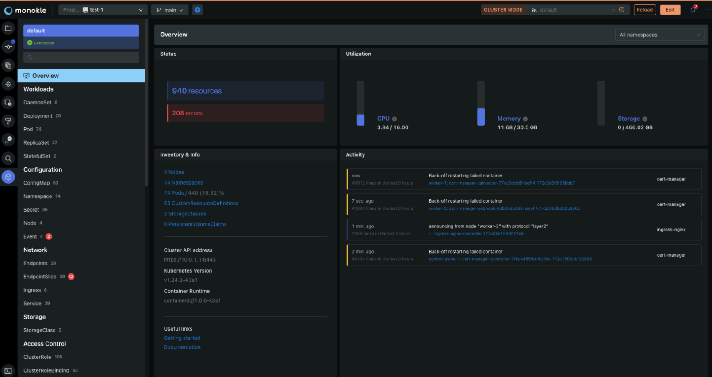
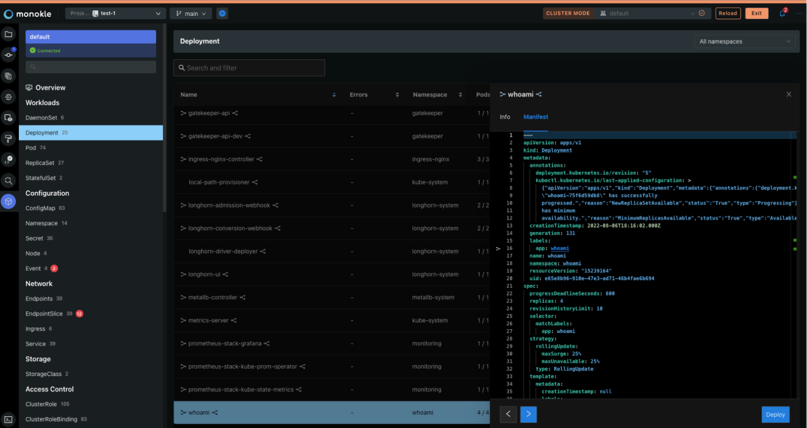
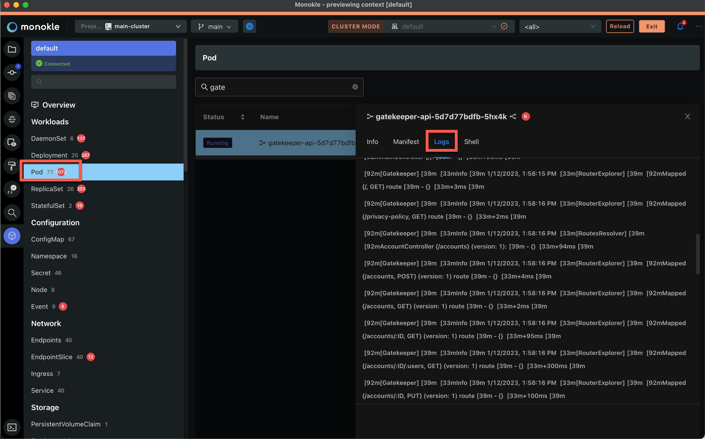
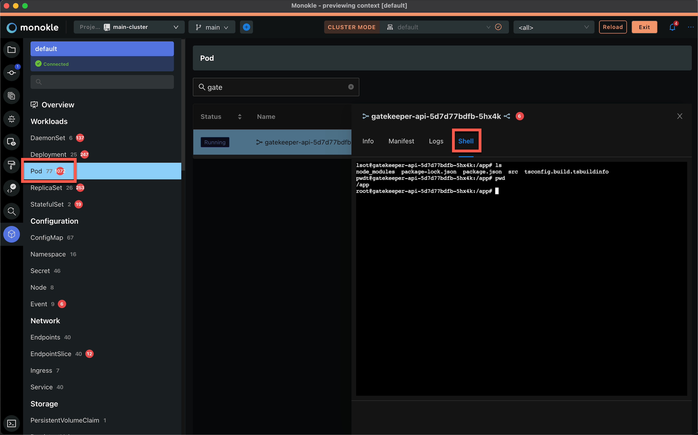

# Cluster Mode

The new Cluster Mode in Monokle 1.13 provides real-time insights into the state of your clusters. Once connected to a cluster, the icon to open Cluster Mode is in the left panel:

The initial overview provides general information about its state and contained resources:

The navigation on the left makes it easy to select types of resources and see their individual state and properties:

And the YAML for each resource can be easily viewed, modified and applied back to your cluster for quick fixes:

## Resource Validation in Cluster Mode

All existing validation functionality already available in Monokle is applied to the resources found in your cluster - making it easy to find resources that have validation warning or errors - for example, in regard to the built-in OPA policies:

These errors are of course also highlighted in the source view - allowing you to immediately fix them and deploy the fixed resource back to your cluster.

## Working with Pods

### The Log Tab

After selecting a pod resource in the cluster dashboard, the log tab allows you to see logs in a specific pod.

### The Shell Tab

On the shell tab, you can interact with a pod, you can run shell commands in this pod and see the results.

