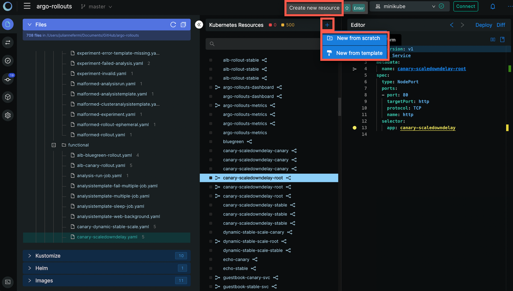
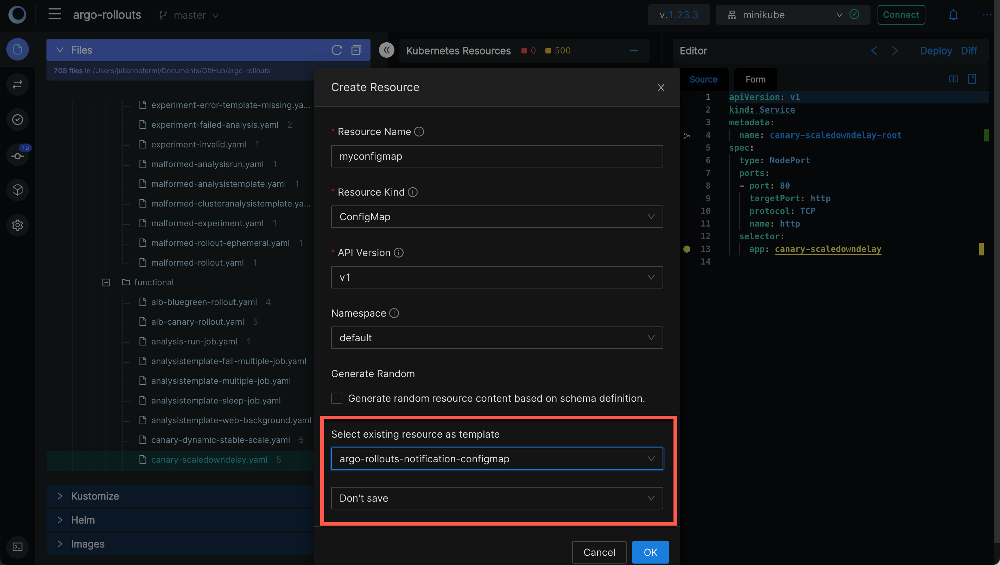
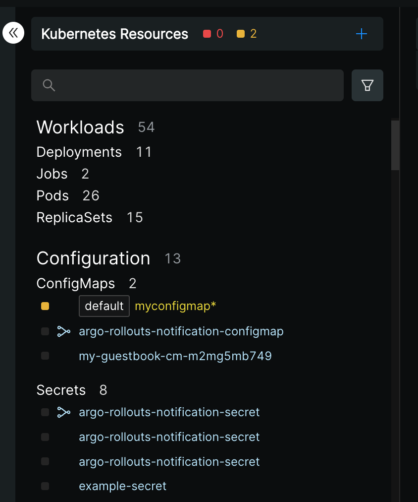
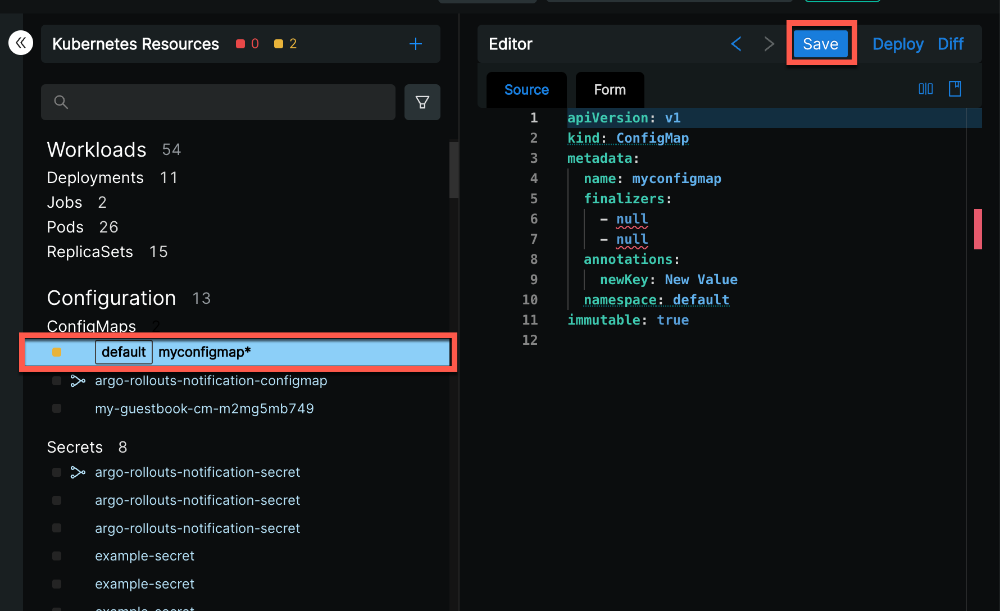
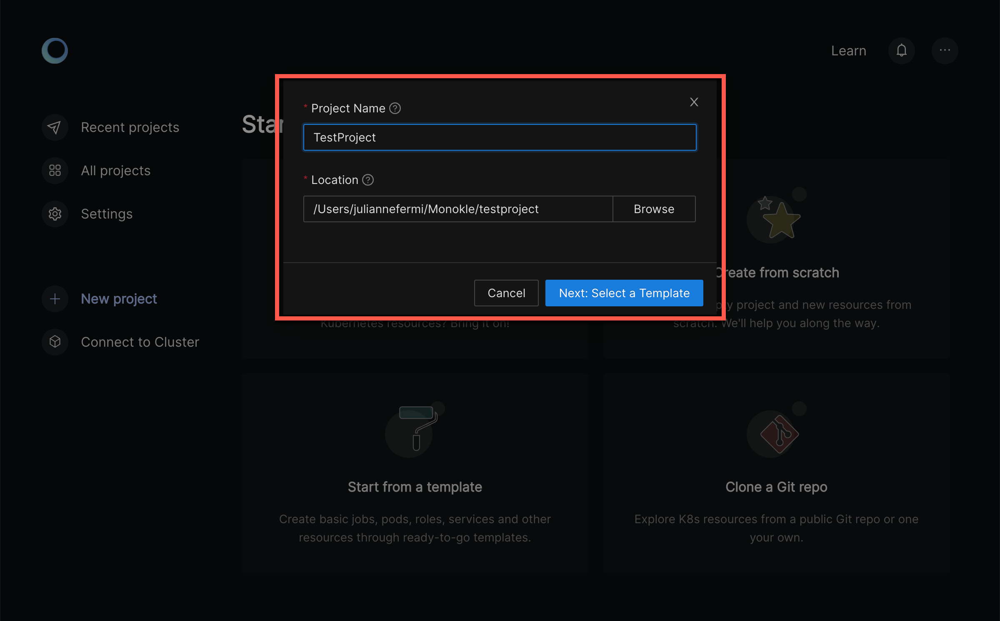
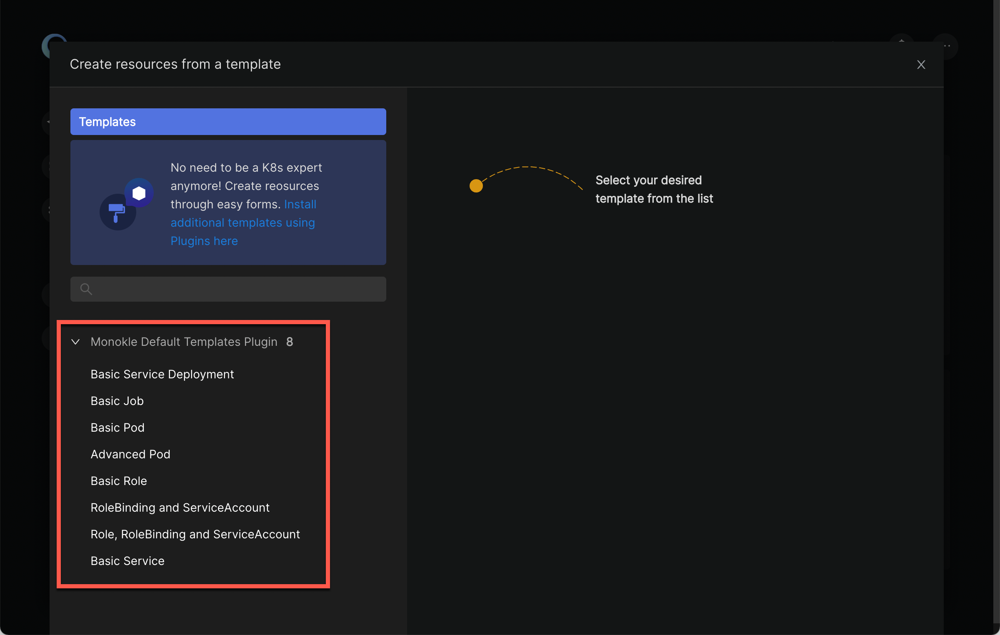
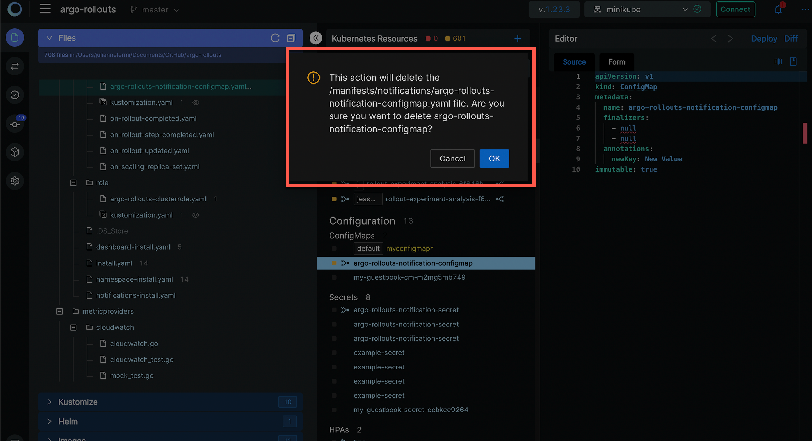

# Creating Resources

## **Add a Resource**

While using Monokle Desktop, you can directly add new K8s resources. Once you have browsed and added your project folder, click on the **Create Resource** button at the top of the navigator to open the **Create Resource** drop down.

Select "New from scratch" or New from template".

## **New from Scratch**

While creating a resource, it is possible to select an existing resource as a template from the drop-down menu. The options for this template are **Save to folder**, **Add to file** and **Don't save**.  

If the last drop down is left as **Don't save**, that resource will be added to the Navigator resources but it will be highlighted in yellow:

These “unsaved” resources will have to be saved by the user to be able to reuse them. Clicking on a yellow resource will show the Save button in the Editor panel to save the highlighted resource.

## **New from Template**

Monokle Desktop allows the use of templates to start a new project via the **Start from a template** option:

The **Create a Project from a Template** dialog appears:

Name your project, select its location and click **Next: Select a Template**.

Monokle Desktop includes a default set of templates which are installed automatically when starting Monokle Desktop for the first time and available in the Templates Explorer when working with your Monokle Desktop projects:

Check out the [Monokle Desktop Default Templates Plugin](https://github.com/kubeshop/monokle-default-templates-plugin) repository to 
see the complete list of templates that are included along with their corresponding schemas and manifests.

## **Navigator Resource Options**

Click the ellipsis to the right of a resource name to see the options available:

### **Deploy a Resource**

You can deploy a resource to a namespace, selecting an existing namespace, creating a new namespace or not choosing a namespace.

<!--### **Diff a Resource**

-->

### **Rename a Resource**

You can rename resources and update all the references associated with that resource to ensure the integrity of that link.

### **Clone a Resource**

You can use the Clone action to create a new resource by using existing resources as a template. 

### **Delete a Resource**

You can use the Delete action in the cluster mode to delete the resource from the actual cluster. 

