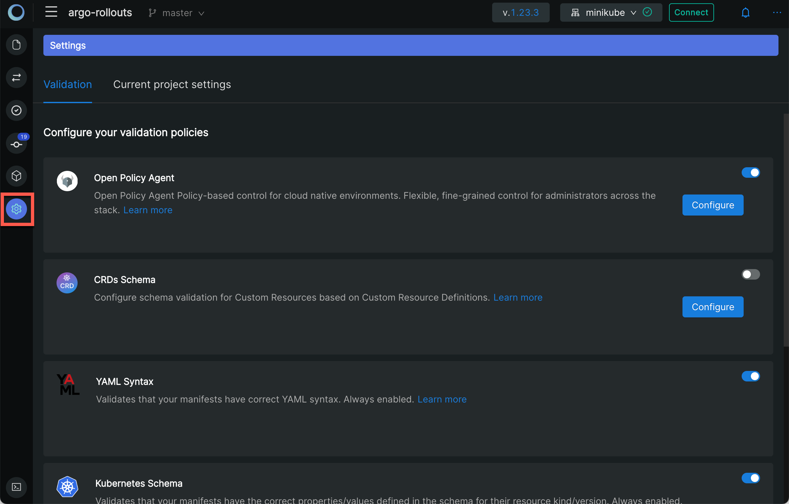
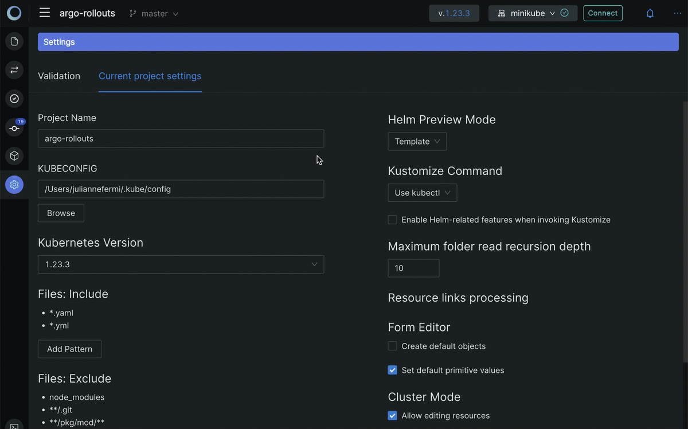
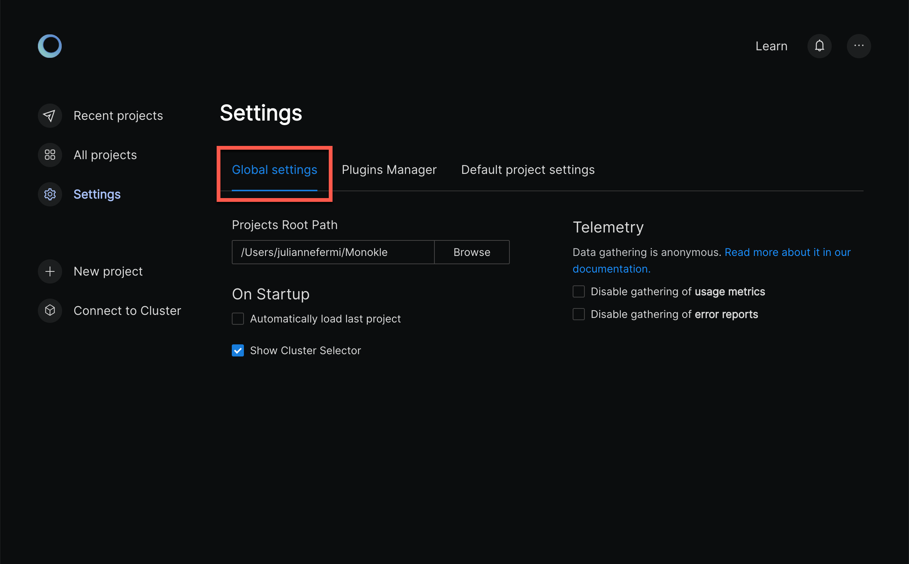
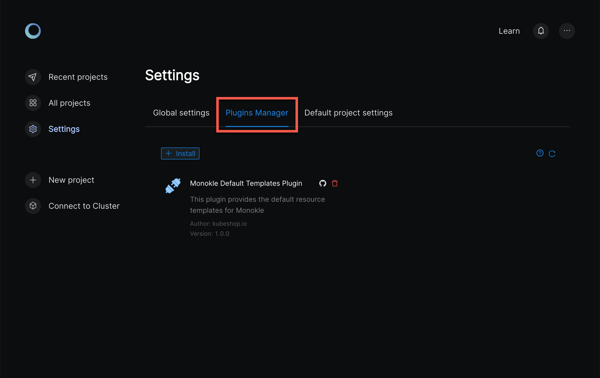
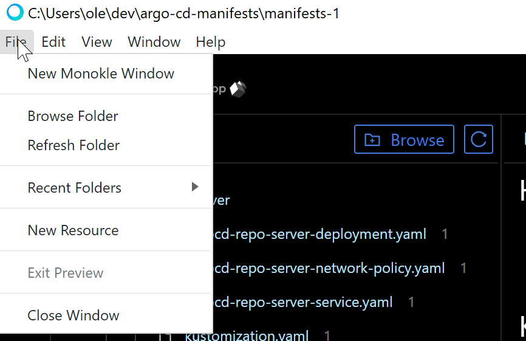
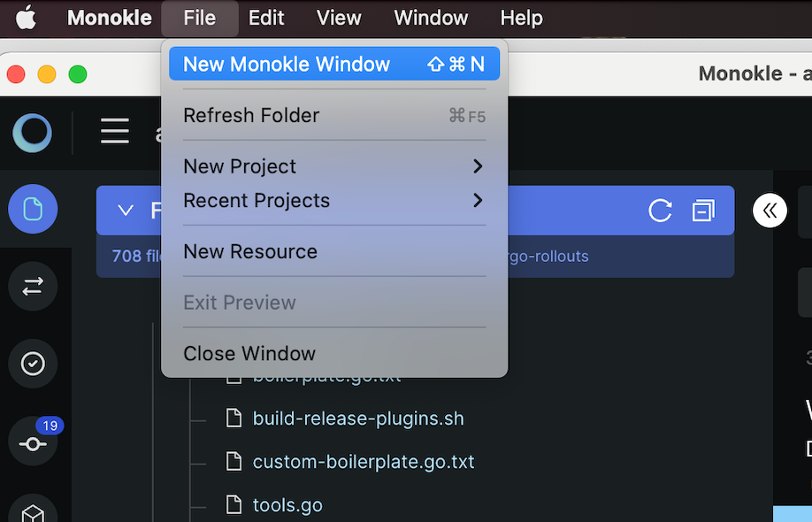
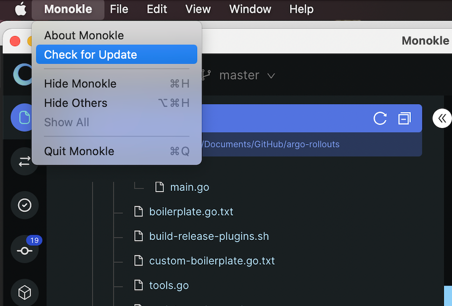

# UI Overview

## **Launch Monokle Desktop**

<em>**Note:** Please follow this [Getting Started](getting-started.md) guide to install Monokle Desktop 🚀</em>

Launch Monokle Desktop and, on the welcome screen, there are three options to start working with projects:

 - Select a folder with K8s resources.
 - Create a project from scratch.
 - Start from a template.
 

On subsequent start-ups, Monokle Desktop automatically loads the most recently selected folder, if the corresponding "Load recent folder on Startup" setting has been enabled:

## **Working with Projects**

Click **Select an existing folder** to add your project folder containing K8 resources. 

Monokle Desktop is laid out like many other desktop applications:

Left to right:

- The vertical toolbar to the far left is where you will find functions like Resource Compare, views for Validation Errors, Git Operations, Cluster Dashboard and Settings which will be described later in the documentation.
- The File Explorer (shown in screenshot) shows the contents of the currently selected folder.
- The Navigator in the center shows all resources found in the current folder or cluster. By default it shows all possible
  Resource sections and subsections - when selecting a folder or cluster only those sections that actually contain
  any resources will be shown.
- The Editor section to the right contains editors/views/actions for the currently selected resource or file.

The top right contains the following buttons:

- The current K8s schema version.
- The currently configured cluster.
- Show Latest Notifications
- An ellipsis with the following selections:
  - **Help**
  - **Keyboard Shortcuts** -> See [Monokle Desktop Keyboard Shortcuts](hotkeys.md) for a complete list of keyboard shortcuts.
  - **Documentation** -> opens the Monokle Desktop documentation in your system browser.
  - **New in (Latest Version)** -> See the most recent updates.
  - **Replay Quick Guide** - Replay the Quick Guide pop ups for Monokle Desktop screen navigation.
  - **GitHub** -> opens the Monokle Desktop GitHub repo in your system browser.
  - **Discord** -> Opens Discord to talk to us about your Monokle Desktop experience.
  - **About Monokle Desktop** -> Details about the current version of Monokle Desktop.
  - **Feedback** -> Our feedback survey.

## **Settings**

While working in a project, clicking the **Settings** icon in the vertical toolbar on the left to open the settings modal for the current project:

The first tab allows you to configure validation policies.

The Current Project Settings tab contains the the setting that can be modified for the open project only.

  - **Project Name**
  - **Kubernetes Version**: Sets Kubernetes' schema version for validation.
  - **Kubeconfig**: Sets which kubeconfig Monokle Desktop should use for all cluster interactions.
  - **Files: Include**: Sets which files to parse for kubernetes resources when scanning folders.
  - **Files: Exclude**: Sets which files/folders to exclude when scanning folders for resources.
  - **Hide excluded files** check box.
  - **Hide unsupported files** check box.
  - **Helm Preview Mode**: Sets which Helm command to use for generating previews (see [Working with Helm Charts](helm.md)).
    - Template: uses [Helm Template](https://helm.sh/docs/helm/helm_template/)
    - Install: uses [Helm Install](https://helm.sh/docs/helm/helm_install/)
  - **Kustomize Command**: Sets how to invoke kustomize when previewing and applying kustomization file.
    - Use kubectl
    - Use kustomize
  - **Maximum folder read recursion depth**: Configures how "deep" Monokle Desktop will parse a specified folder (to avoid going too deep).
  - **Resource links processing**:
    - Ignore optional unsatisfied links.
  - **Form Editor**
    - Create default objects.
    - Set default primitive values.
  - **Cluster Mode**
    - Allow editing resources.
  - **UI Preferences**
    - Hide editor placeholder.

## **Global Settings**

<!--  -->

Click the Monokle icon in the top left corner to return to the Monokle home page and click on settings.

    
### **Global Settings** 
  - **Projects Root Path**
  - **On Startup**: 
    - Automatically load last project.
    - Show Cluster Selector.
  - **Telemetry**:
    - Disable gathering of usage metrics.
    - Disable gathering of error reports.

### **Plugins Manager**

See [Monokle Plugins Manager](plugins.md) for complete details.

### **Global Project Settings**

  - **Project Name**
  - **Kubernetes Version**: Sets Kubernetes' schema version for validation.
  - **Kubeconfig**: Sets which kubeconfig Monokle Desktop should use for all cluster interactions.
  - **Files: Include**: Sets which files to parse for kubernetes resources when scanning folders.
  - **Files: Exclude**: Sets which files/folders to exclude when scanning folders for resources.
  - **Hide excluded files** check box.
  - **Hide unsupported files** check box.
  - **Helm Preview Mode**: Sets which Helm command to use for generating previews (see [Working with Helm Charts](helm.md)).
    - Template: uses [Helm Template](https://helm.sh/docs/helm/helm_template/)
    - Install: uses [Helm Install](https://helm.sh/docs/helm/helm_install/)
  - **Kustomize Command**: Sets how to invoke kustomize when previewing and applying kustomization file.
    - Use kubectl
    - Use kustomize
  - **Maximum folder read recursion depth**: Configures how "deep" Monokle Desktop will parse a specified folder (to avoid going too deep).
  - **Resource links processing**:
    - Ignore optional unsatisfied links.
  - **Form Editor**
    - Create default objects.
    - Set default primitive values.
  - **Cluster Mode**
    - Allow editing resources.
  - **UI Preferences**
    - Hide editor placeholder.

## **System Menu**

Monokle Desktop provides a system menu with the common File/Edit/View/Window/Help functionality.

Mac System Menu:

Windows System Menu:

## **Multiple Windows**

You can launch multiple project windows using the New Monokle Desktop Windows option. This allows you to work on multiple folders or clusters simultaneously. Thus visual navigation for the recently used pages becomes simpler and faster.

**Action:** File > New Monokle Desktop Window

## **Auto-update**

The Monokle Desktop (on Mac) / Help (on Windows) system menus provide a "Check for Update" action that will check for an update
and prompt to download, if available.

