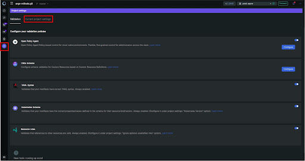
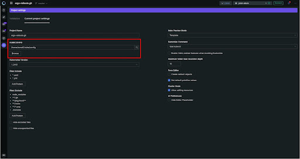
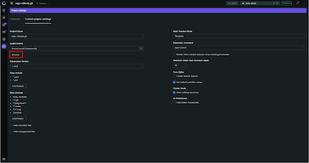
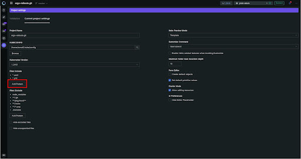
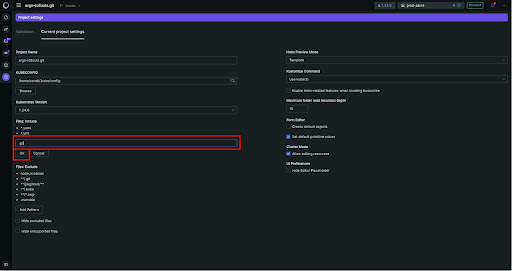
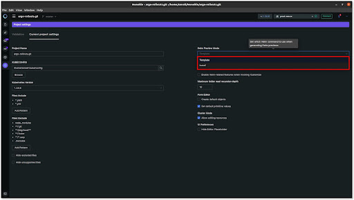

# How to Configure Monokle

Getting started with Monokle is easy.

Configure your Monokle Environment in a few minutes by following this step-by-step configuration guide.

<em>**Note:** All settings are initialized with default values - there is no immediate need to change them. </em>

Let’s get started! 

## **1. Open Settings**

Launch Monokle. Then. click on the **Settings** button to access the Settings widget:

## **2. Set kubeconfig**

Enter the kubeconfig file path in the KUBECONFIG text field. The kubeconfig parameter is used when viewing cluster
resources, deploying, and/or diffing local resources with cluster resources.

Alternatively, you can click on the Browse button to fetch the kubeconfig file for configuring cluster access.

To configure your cluster, select the required folder.

<em>**Note:** The kubectl command-line tool uses kubeconfig files to find the information for choosing a cluster and communicating with the API server.</em>

## **3. Files: Include**

Monokle will look for Kubernetes manifests in files matching the chosen filter, by default this is set to *.yaml/*.yml files.
Click on the **Add Pattern** button to include the files having the corresponding extension.

Enter the extension pattern in the Files Include textbox. When finished, click **OK**. 

To reflect all changes, click on Apply. For deleting any extension pattern, hover over the extension, and click on the Delete icon. Then, click on Apply to ensure the change is made.

## **4. Files: Exclude**

To ignore specified files, folders or paths, click on the **Add Pattern** button and configure the pattern, files, or folders you want to exclude by including the corresponding extension. For example, node_modules.

Enter the extension pattern in the Files Exclude textbox and then, click the OK button. 

Select Apply changes to ensure the changes have been saved and are reflected in your configuration.

For deleting any extension pattern at a later time, hover over the extension, click on the delete icon, and then, click Apply to save the changes made.

## **5. Helm Preview Mode**

Click on the Helm Preview Mode dropdown to select viewing states. The options for previews are:

- **Template** - [Helm Template command](https://helm.sh/docs/helm/helm_template/)
- **Install** - [Helm Install command](https://helm.sh/docs/helm/helm_install/)

## **6. Kustomize Command**

Click on the Kustomize Command dropdown to select the necessary command for kustomizations. The options for the command are:

- Use [kubectl](https://kubernetes.io/docs/tasks/manage-kubernetes-objects/kustomization/)
- Use [kustomize](https://kubectl.docs.kubernetes.io/references/kustomize/cmd/)

Review these 6 configuration settings as needed to keep Monokle customized to your needs.

## **Questions or Comments?**

Please feel free to join our open source community on Discord with this [Invite Link](https://discord.gg/6zupCZFQbe) and start your discussion.
