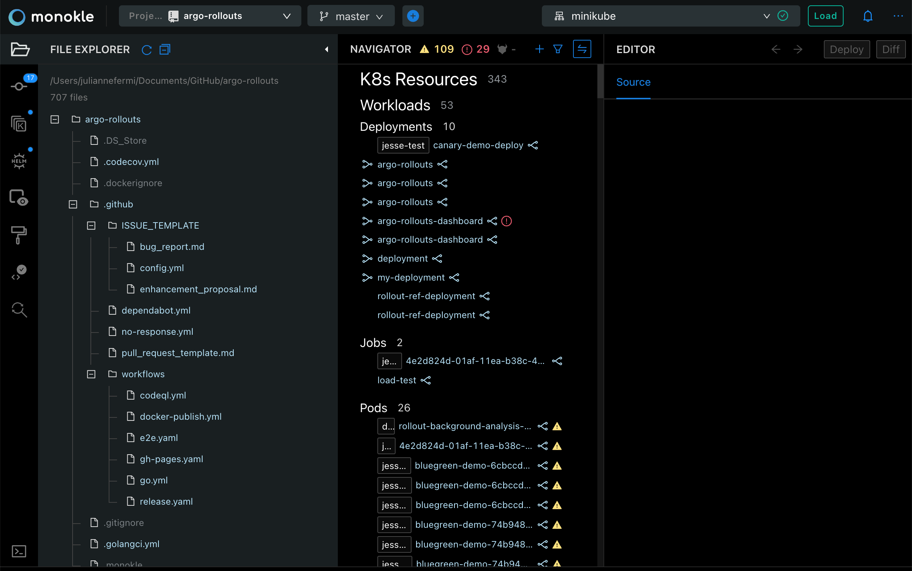
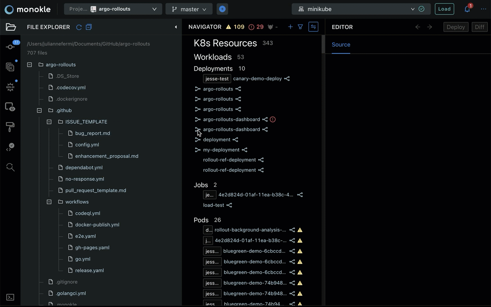
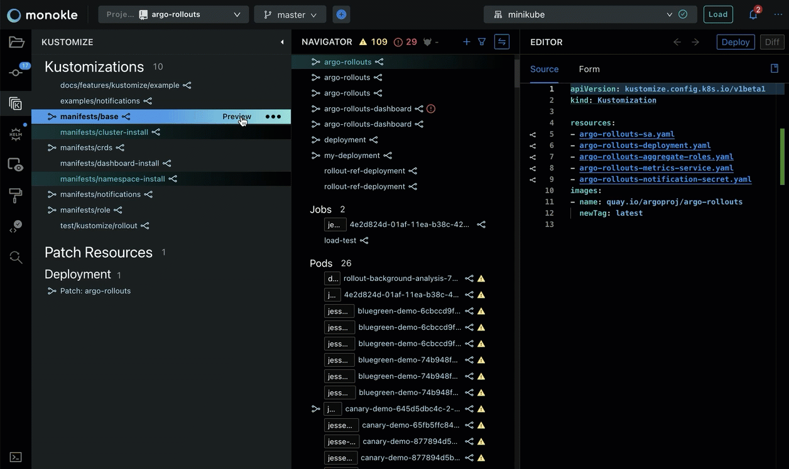
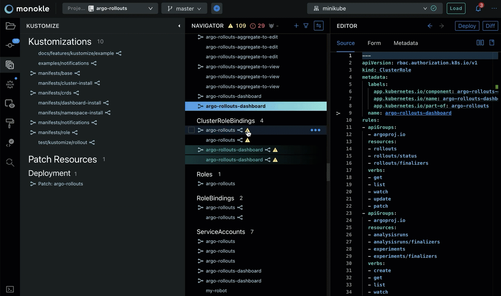
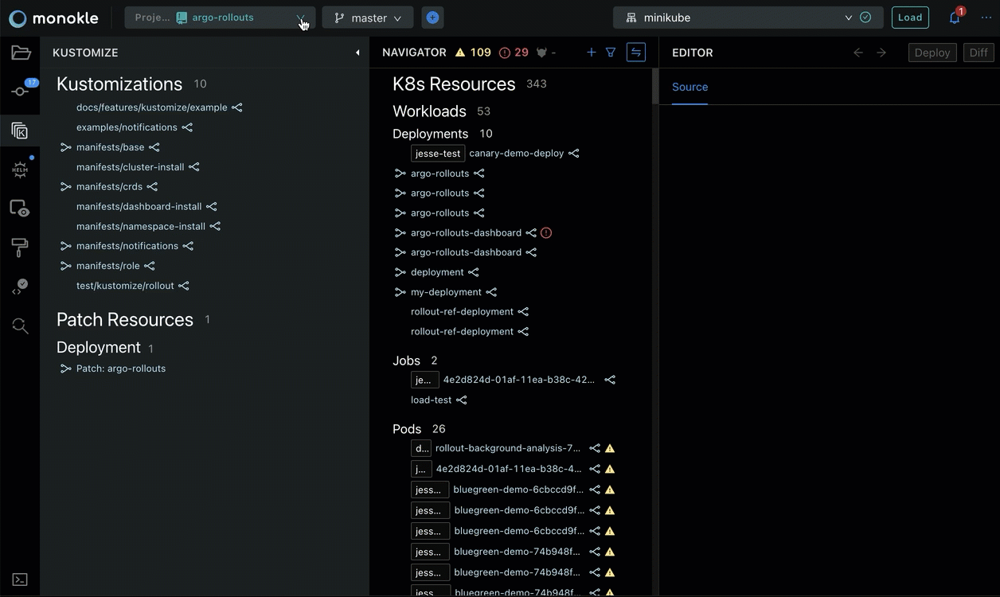
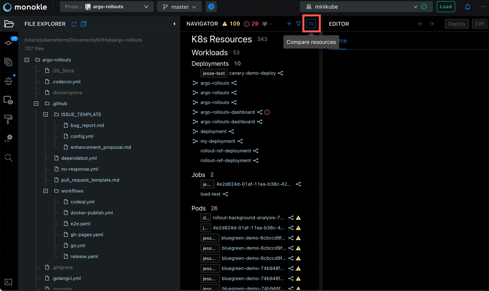
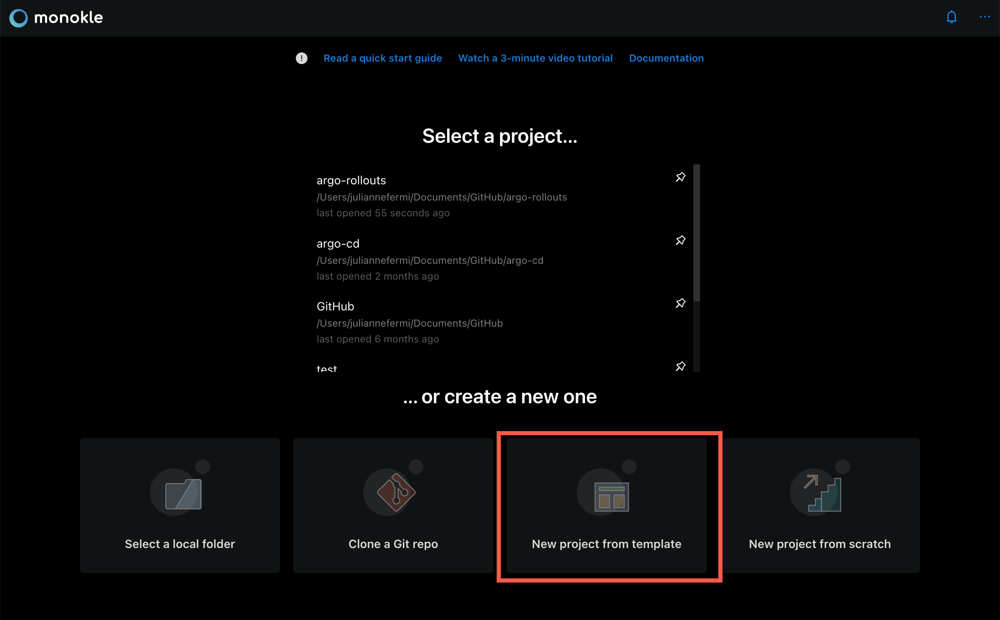
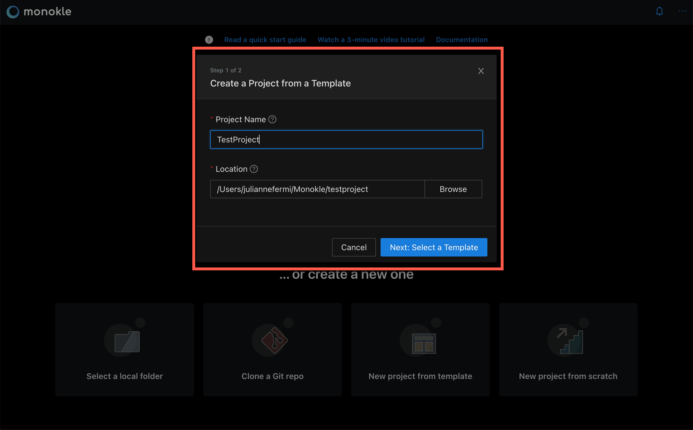
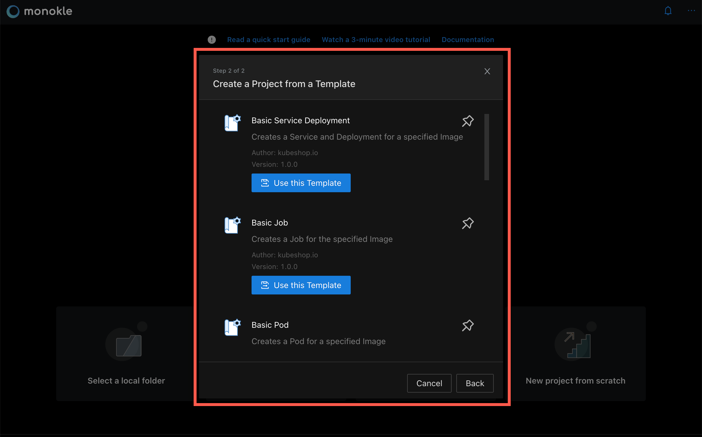

# Feature Overview

Here is a short list of some of the features currently in Monokle Desktop.

A big thanks to the excellent [Argo-Rollouts](https://github.com/argoproj/argo-rollouts/) project on GitHub for
providing plentiful manifests for us to run Monokle Desktop against.

## **Navigate K8s Objects Easily**

Monokle Desktop compiles a list of all the objects in your repo (from files you didn't want ignored), to give you a handy
overview of all your resources - [read more here](resource-navigation.md).

## **Validate and Follow Links Up- or Downstream through your Manifests**

Surf upstream or downstream through your resources! Monokle Desktop highlights other resources that your selection has direct
relations to and even provides you with the links to go to them quickly - [read more here](resource-navigation.md).

## **Preview Resources Generated by Kustomize and Helm**

Do a quick dry-run, enabling you to navigate and debug the resources created by Kustomize or Helm. Apply them to
the cluster when you are satisfied - read more about [Kustomize](kustomize.md) and [Helm](helm.md).

## **Locate Source File Quickly and Find Dead-end Links**

When you select a resource, Monokle Desktop will show which file it was defined in. A yellow warning triangle indicates that a resource is pointing to a link that does not exist.

## **Browse and Update Cluster Objects**

To browse a cluster instead of a repo, simply click the "Load" button to import all objects from
the cluster into Monokle Desktop - [read more](cluster-integration.md). If you need to make any immediate hot-fixes, simply modify
the resource in the source editor and click the "Apply" button.

## **Manage Multiple Projects**

Easily switch in between projects to more efficiently work with multiple projects at the same time.

## **Compare Resources**

The Editor contains a **Compare Resources** button at the top right.

Selecting **Compare Resources** will open the Comparing Resources window:

Almost anything that you work on in Monokle Desktop can be compared. Select from the drop down on the left side and the right side to do a compare of a local resource, a Kustomize or Helm preview or a cluster:

## **Create a Resource from a Template**

Monokle Desktop allows the use of templates to start a new project via the **Start from a template** option:

The **Create a Project from a Template** dialog appears:

Name your project, select its location and click **Next: Select a Template**.

Monokle Desktop includes a default set of templates which are installed automatically when starting Monokle Desktop for the first time and available in the Templates Explorer when working with your Monokle Desktop projects:

Check out the [Monokle Desktop Default Templates Plugin](https://github.com/kubeshop/monokle-default-templates-plugin) repository to 
see the complete list of templates that are included along with their corresponding schemas and manifests.

