# Feature Overview

Here is a short list of some of the features currently in Monokle.

A big thanks to the excellent [Argo-Rollouts](https://github.com/argoproj/argo-rollouts/) project on GitHub for
providing plentiful manifests for us to run Monokle against.

## Navigate k8s objects easily

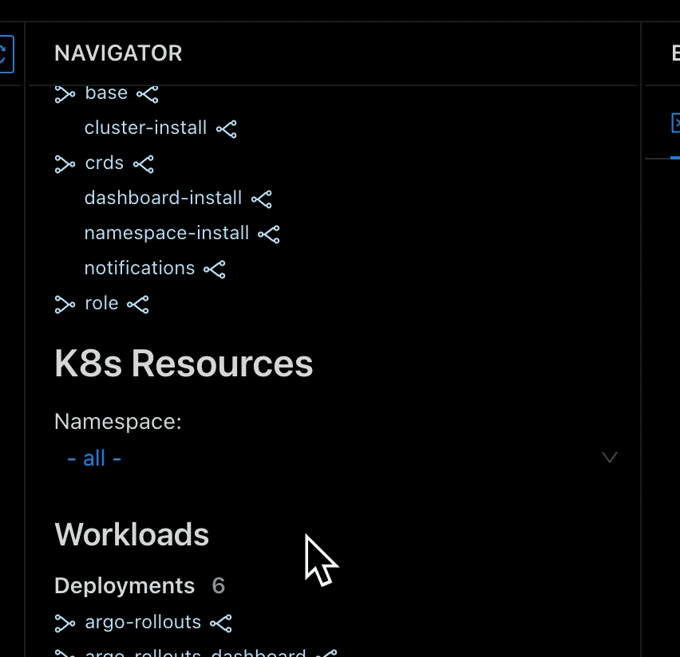

Monokle compiles a list of all the objects in your repo (from files you didnt want ignored), to give you a handy
overview of all your resources - [read more](resource-navigation.md)

## Validate and follow links up- or downstream through your manifests

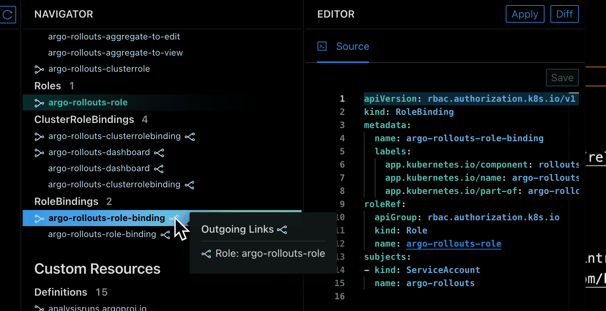

Surf up- or downstream through your resources! Monokle highlights other resources, that your selection has direct
relations to and even provides you with the links to go to them quickly - [read more](resource-navigation.md)

## Preview resources generated by kustomize and Helm

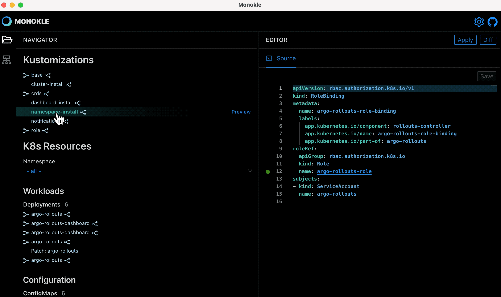

Do a quick dry-run, enabling you to navigate and debug the resources created by Kustomize or Helm. Apply them to
the cluster if you are satisfied - read more about [Kustomize](kustomize.md) and [Helm](helm.md)

## Locate source file quickly, and see if links are dead-ends

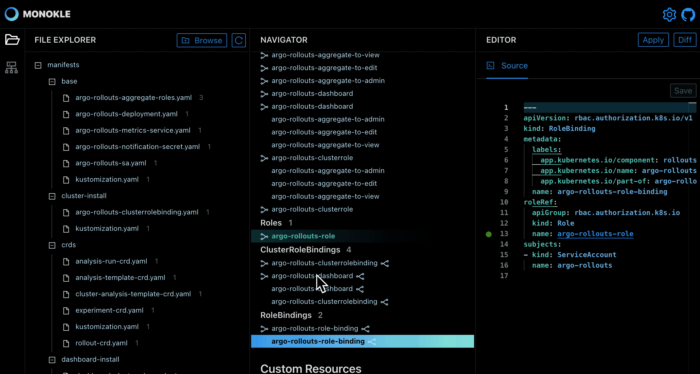

When you select a resource, Monokle will show you which file it was defined in. Also, if you mistype a referenced
resource, Monokle will quickly show you, that you have a dead link with a warning triangle.

## Browse and update your clusters objects

Want to browse your cluster instead of a repo? Simply smash the "Show Cluster Objects" button to import all objects from
the cluster into Monokle - [read more](cluster-integration.md). If you need to make any immediate hot-fixes simply modify
the resource in the source editor and click the "Apply" button.

## Cluster Compare

Cluster Compare functionality in Monokle 1.3.0 allows you to compare a set of local resources (plain or generated with Kustomize/helm) against a cluster. 

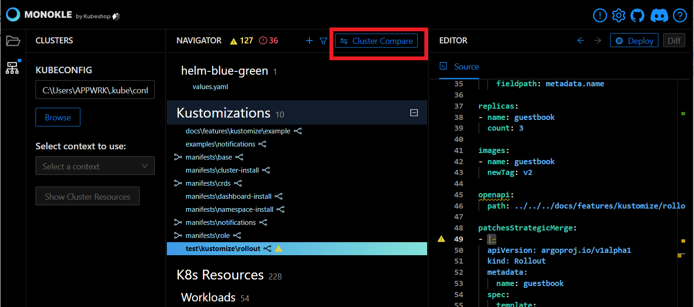

##  Improved Validation Logic and Error Display

Since Monokle 1.3.0, all the errors can be found at the top of the resource navigator to view the invalid resources.  

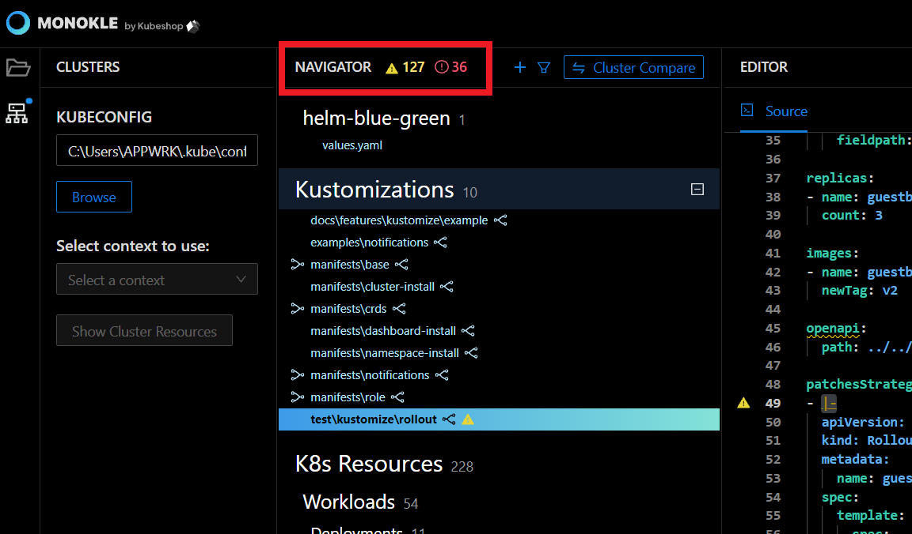

Selecting a resource from the list will automatically open it for editing in the editor.  
[The Improved Validation Logic and Error Display](img/resourcenavigator.gif)

## Handling Multiple KubeConfig Contexts

If the selected Kubernetes file contains numerous contexts, Monokle will find those and allow you to select the right one for your cluster operations. 

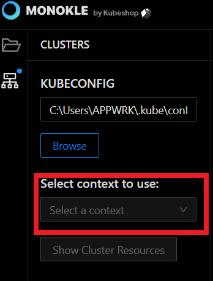

## Linux installer/Packages 

Monokle 1.3.0 includes several packages for different Linux distros. 

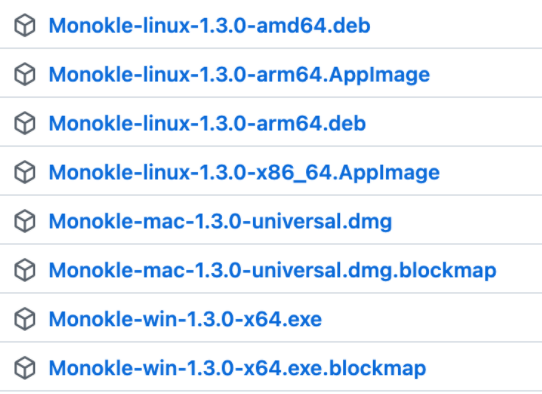

## Improved Kustomize Support

The Monokle 1.3.0 supports all types of kustomization files with or without the kind/api version. Moreover, it also offers an option to choose the command to run kustomize.  

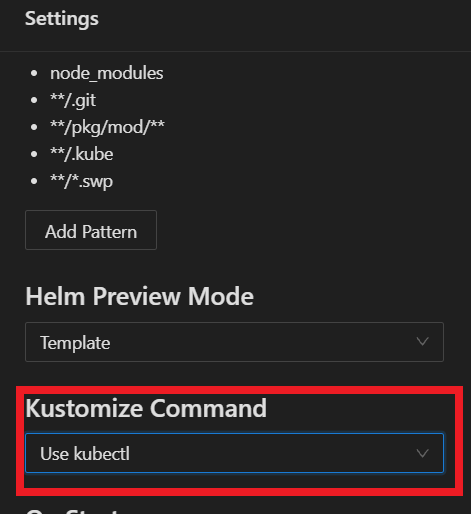

## Managing Optional References 

Monokle 1.3.0 does not show incorrect optional references as errors in resources. 

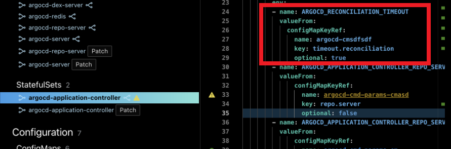

As can be observed from the above snippet, configMapKeyRef has a value set to true - showing no error for the invalid for the name reference, in comparison to the one below which is set to false.  

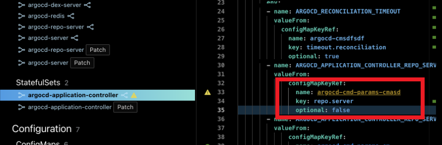

You can disable this behavior in the Settings pane by selecting “Ignore Optional Unsatisfied Links.” 

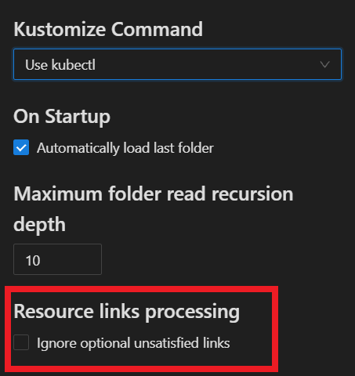

## “Unknown Resource Kind” Shown In Navigator 

In Monokle 1.3.0 unrecognized resources show under a dedicated “Unknown” section are placed at the bottom of Navigator. 

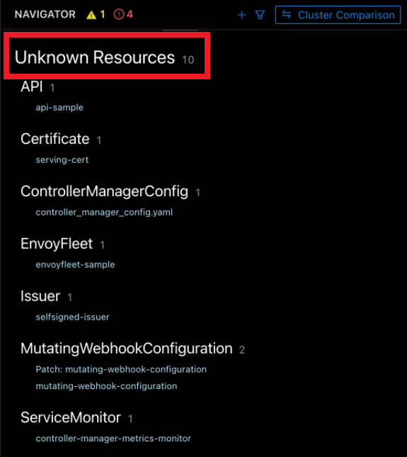

## Notification Centre 

In Monokle 1.3.0, a Notification center is added that gives you a quick view of all the past notifications. 

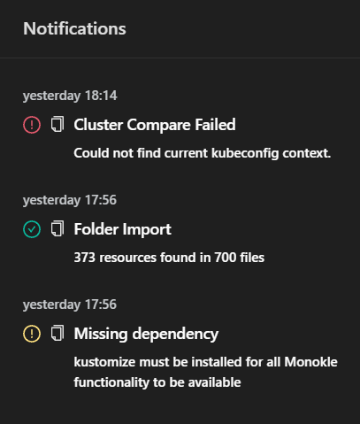
