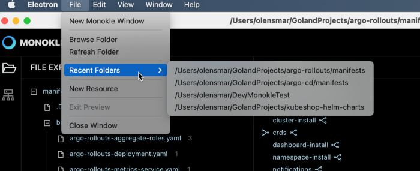

# Feature Overview

Here is a short list of some of the features currently in Monokle.

A big thanks to the excellent [Argo-Rollouts](https://github.com/argoproj/argo-rollouts/) project on GitHub for
providing plentiful manifests for us to run Monokle against.

## Navigate k8s objects easily

Monokle compiles a list of all the objects in your repo (from files you didnt want ignored), to give you a handy
overview of all your resources - [read more](resource-navigation.md)

## Follow links up- or downstream through your manifests

Surf up- or downstream through your resources! Monokle highlights other resources, that your selection has direct
relations to and even provides you with the links to go to them quickly - [read more](resource-navigation.md)

## Preview the resources created by kustomize and Helm

Do a quick dry-run, enabling you to navigate and debug the resources created by Kustomize or Helm. Apply them to
the cluster if you are satisfied - read more about [Kustomize](kustomize.md) and [Helm](helm.md)

## Locate source file quickly, and see if links are dead-ends

When you select a resource, Monokle will show you which file it was defined in. Also, if you mistype a referenced
resource, Monokle will quickly show you, that you have a dead link with a warning triangle.
## Browse your clusters objects

Want to browse your cluster instead of a repo? Simply smash the "Show Cluster Objects" button to import all objects from
the cluster into Monokle - [read more](cluster-integration.md)

## Auto-update Installers

Installers are notarized for both macOS and Windows, which allows you to auto-update functionalities. Monokle checks for new versions on startup and notifies the user. You can also install it manually via the new system menu. 

**Action:** Electron > Check for Update

## Recent Folders

The recent Folders option has been added to the system menu to make it easy to switch between your favorite resource-manifest folders. 

**Action:** File > Check for Update

## Multiple Windows

You can launch multiple project windows using the New Monokle Windows option. It allows you to work on multiple folders or clusters simultaneously. Thus visual navigation for the recently used pages becomes simpler and faster.   

**Action:** File > New Monokle Windows

