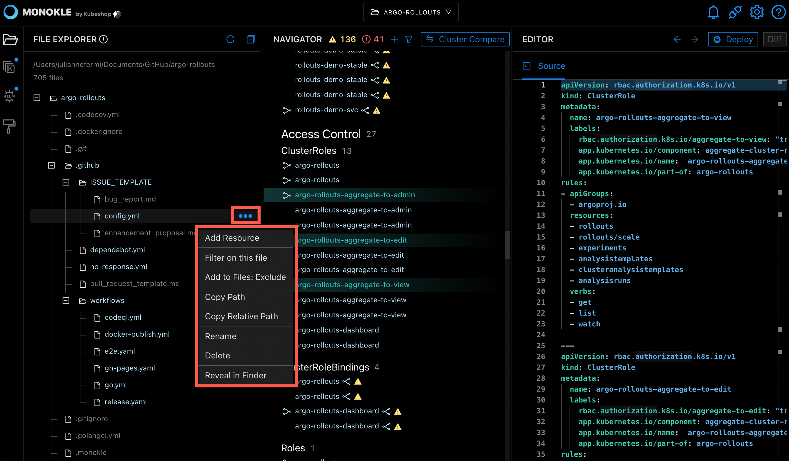

# File Explorer

- The File Explorer shows all files parsed in the folder selected:
  - Excluded files are greyed out.
  - Files containing resource manifests have a number displayed after them, showing the number of 
    resources found in that file.

Selecting a file will highlight contained resources in the Navigator and attempt to scroll them into view. The contents of the 
file will be shown in the source editor to the right - allowing for direct editing of the file.

In this screenshot:

- The argo-rollouts-aggregate-roles.yaml file is selected - the "3" after the filename indicates it contains 3 kubernetes resources.
- The 3 ClusterRole resources in thie file are highlighed in the Navigator in the middle.
- The contents of the file are shown in the editor to the right.

While in the File Explorer, the File Action drop down list is available by clicking the ellipsis to the right of the file name.

In the File Actions pop up menu, the following actions are available:

- Add Resource
- Filter on this file
- Add to Files: Exclude
- Copy Path
- Copy Relative Path
- Rename
- Delete
- Reveal in Finder

The same functionality is available for Folders:

In the Folder Actions pop up menu, the following actions are available:

- New Folder
- New Resource
- Filter on this folder
- Add to Files: Exclude
- Copy Path
- Copy Relative Path
- Rename
- Delete
- Reveal in Finder