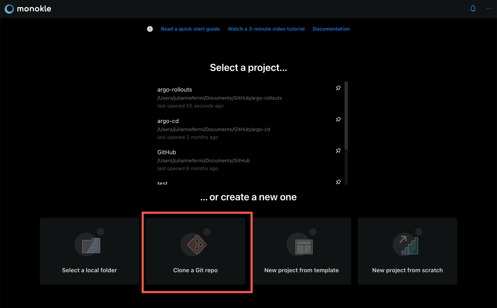
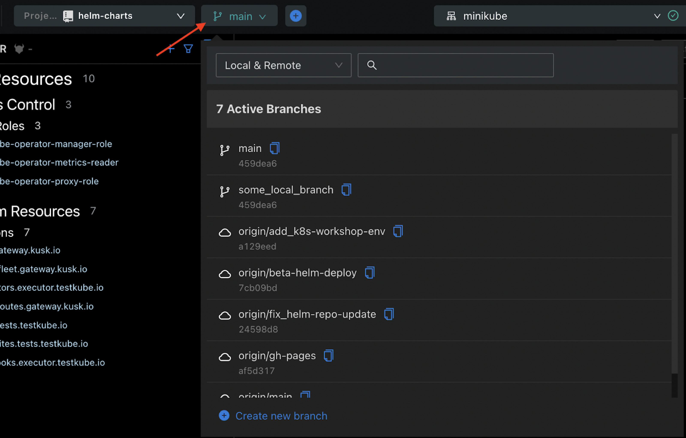
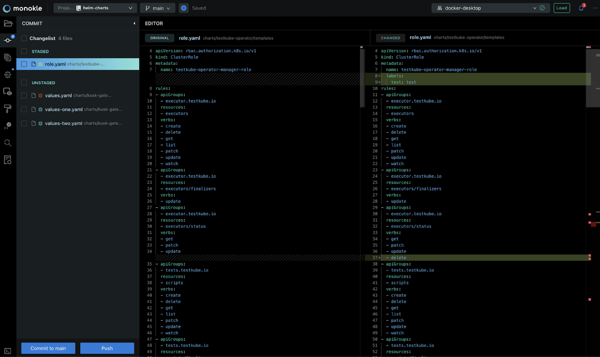

# Git Integration for DevOps & GitOps

Git is integrated into Monokle to tackle GitOps seamlessly within the application. If you work within a DevOps culture our Git integration provides advantages for you and your team by keeping a history of changes made to your applications stored in Git to ensure access to a reliable audit trail of your changes.

## **Getting Started with a New Project: Clone a Git repository**

You can use a Git repository URL to start a new project. The repository will be cloned to the selected location and then opened into Monokle.

This allows multiple colleagues to debug, validate, and diff all of your configuration files taking full advantage of all of the features of Monokle to achieve your desired state while also maintaining clear control of your version changes.

## **Branch Selector**

In the header, next to the Project Selector, a dropdown menu appears whenever Monokle detects the current project has a Git repository.

With the Branch Selector, you can search through all of your local and remote branches in more detail while having the option of creating new local branches.

## **Git Panel**

In the left menu of Monokle, there is a dedicated Git panel.

This panel contains the **Changelist** which is grouped into two lists: **Staged** and **Unstaged** files. By clicking on each file, you will immediately see the differences between the old version and the newer, modified version with valuable insight as you work to achieve your desired state. 

Using the checkboxes, select multiple files to apply the same action at once. After staging some of the files, you can commit the changes directly via Monokle. Once staged changes have been committed, unpublished branches can be directly published to remote through Monokle simply push your commits.

