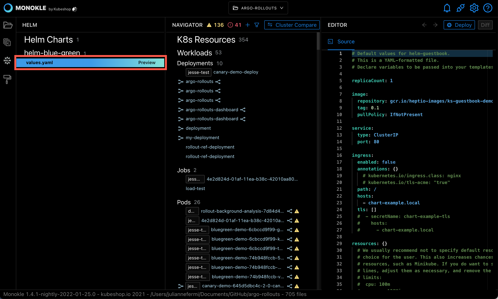
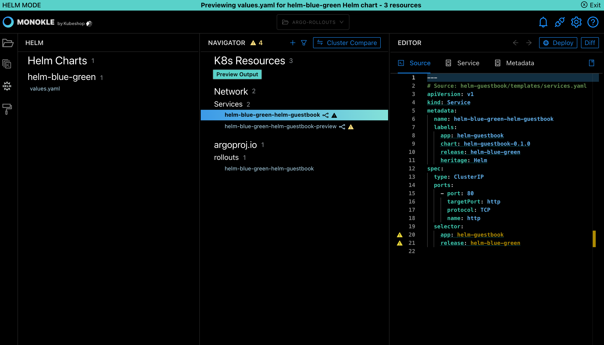
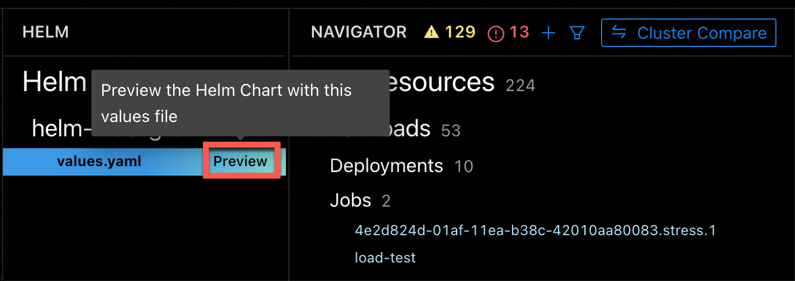

# Working with Helm

Monokle has built-in support for [Helm](https://helm.sh/) - a popular tool for managing kubernetes configurations:

- Monokle can identify and show Helm charts and their values files.  
- Monokle can preview resources generated by Helm, helping you debug your charts before you deploy them to your cluster. Requires Helm to be installed and configured in your PATH.

All examples below are from the [Emissary Ingress charts folder](https://github.com/emissary-ingress/emissary/tree/master/charts/emissary-ingress) - clone and try these yourself!

## **Helm Navigation**

When selecting a folder containing Helm charts (identified by Chart.yaml files), these will automatically be displayed in 
a "Helm Charts" section on top of the Navigator:

In the screenshot:

* The Helm Charts section shows the "emissary-ingress" Helm chart and the contained values files.
* The single values.yaml file has been selected.
* The corresponding values.yaml file has been highlighted to the left.
* The content of the file is shown in the Source editor to the right.

The Navigator at this point shows any K8s resources that Monokle finds in the selected folder.

## **Helm Preview**

The Helm Preview functionality helps you understand what resources would be installed in your cluster when running Helm with 
a specific values file.

Hovering over a values file reveals a **Preview** action to the right:

Selecting this action will run Helm on the selected file with either the `install` or `template` option (as configured in the global settings)
and replace the contents of the Navigator with the generated resources.

For example, previewing the values file above will result in the following:

Monokle is now in **Preview Mode** (as indicated by the header at the top):

- The File Explorer has been disabled.
- The Navigator now contains all resources generated by running Helm with the selected values file.
    - Resource navigation works as with files; selecting a resource shows its content in the source editor in read-only mode.
    - Resource links are shown as before with corresponding popups/links/etc.
- Selecting **Preview** for a different values file will switch the preview to the output of Helm for that file.
- Selecting **Exit** in the top right or next to the values file restores the previous resource navigator.

## **Editing of Values Files During Preview**

When previewing a Helm values file, it is possible to edit the previewed file and recreate the preview, allowing
you to quickly assess the impact of any changes on the generated files, instead of having to exit and recreate the preview to make a change.
 

