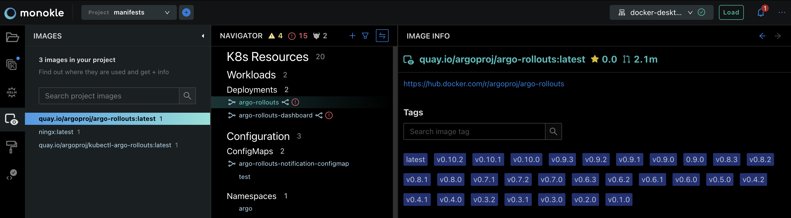
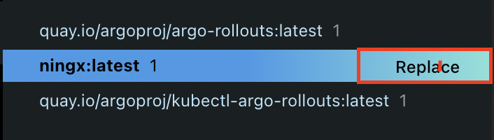
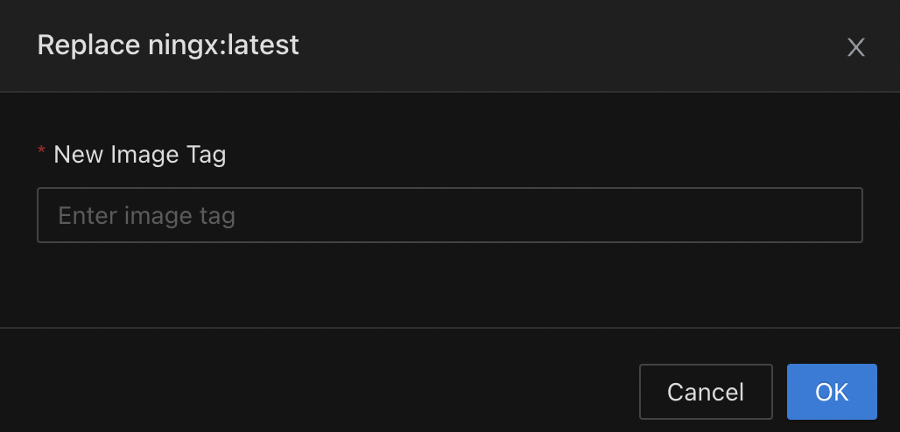

# Working with Images

Monokle Desktop has a dedicated Images panel which can be accessed from the left menu:

This panel will show the list of all images that are found in the Navigator.
The list of images will changed based on the Mode you're in:
- Local mode
- Preview mode (Helm or Kustomize)
- Cluster mode

Clicking on an Image will select it and will open an Image Details panel on top of the Editor.

In the panel, you can find basic information about the image and browse the image's tags.

Hovering over an image will show the "Replace" action:

Clicking on "Replace" will open a modal which allows you to enter a new tag for that image:

After clicking "Done", the tag will be replaced with the newly specified value across all your resources.
