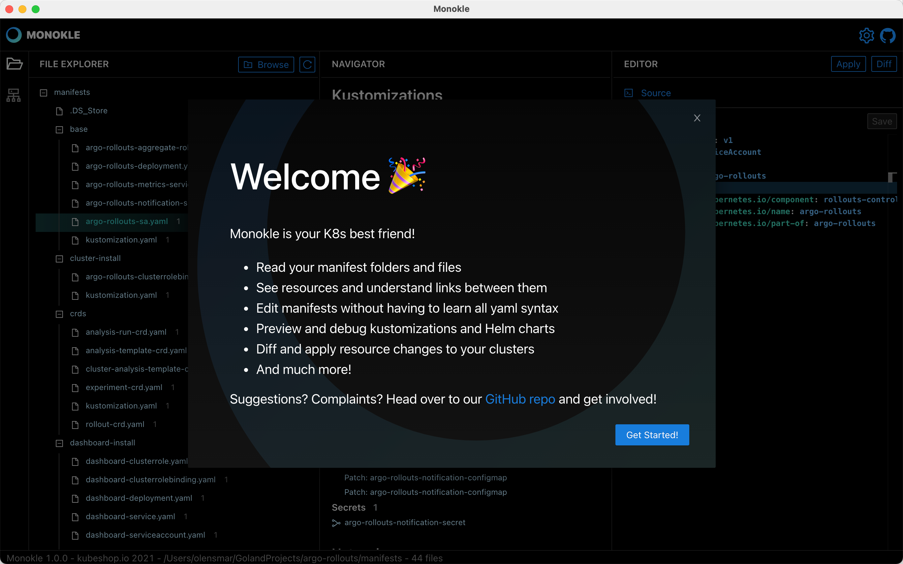

# Monokle

Welcome to Monokle - your friendly desktop UI for managing k8s manifests!

Monokle helps you
- Quickly get a high-level view of your manifests, their contained resources and relationships
- Easily edit resources without having to learn or look up yaml syntax
- Refactor resources with maintained integrity of names and references
- Preview and debug resources generated with kustomize or Helm
- Diff resources against your cluster and apply changes immediately
- Visualize and navigate resources in your clusters
- And much more!

Check out the [Features Document](features.md) or watch the Monokle 1.0 walkthrough video below

