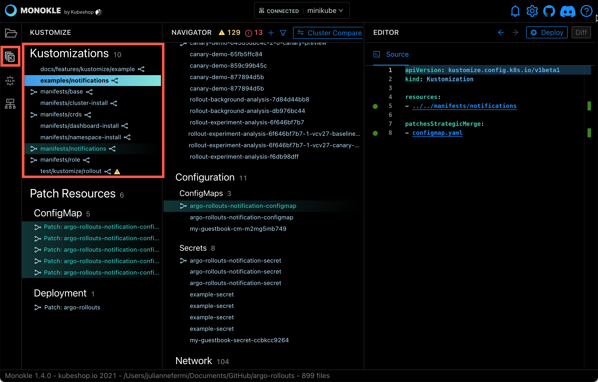
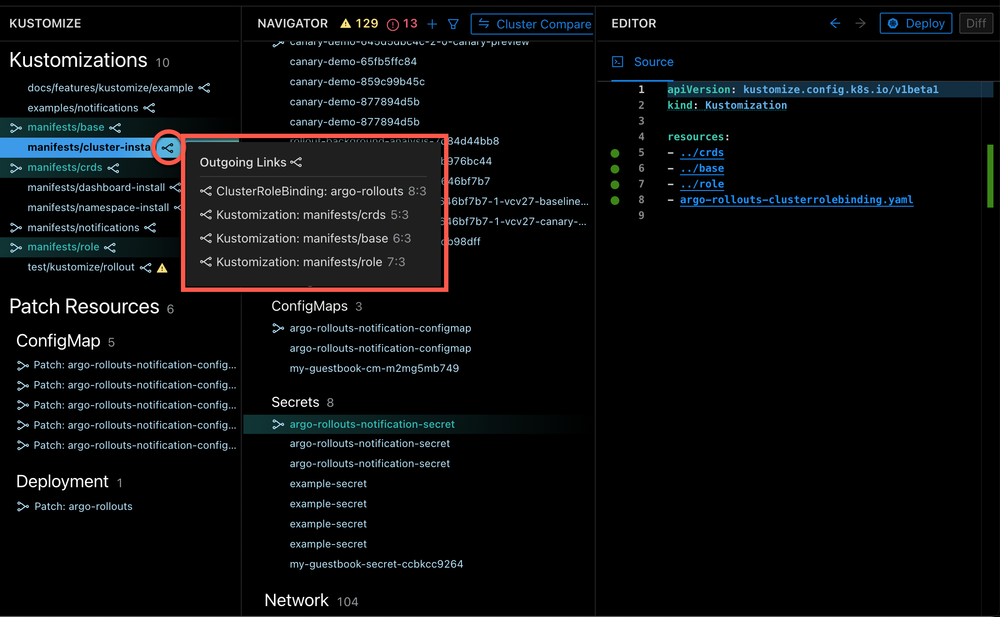
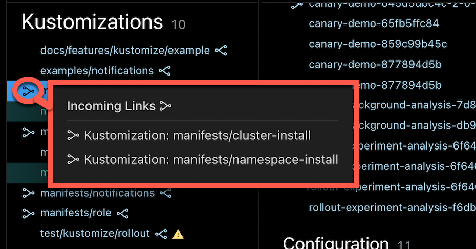
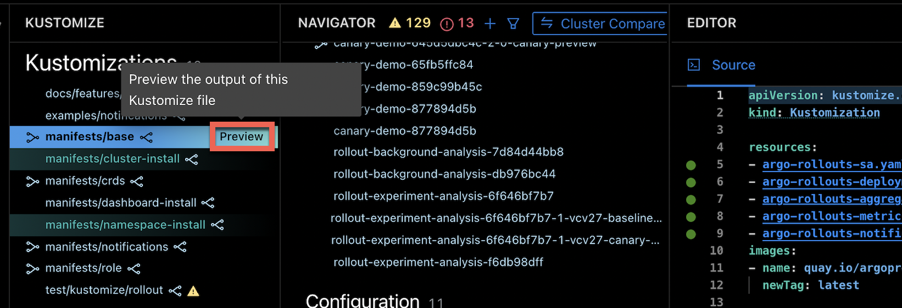
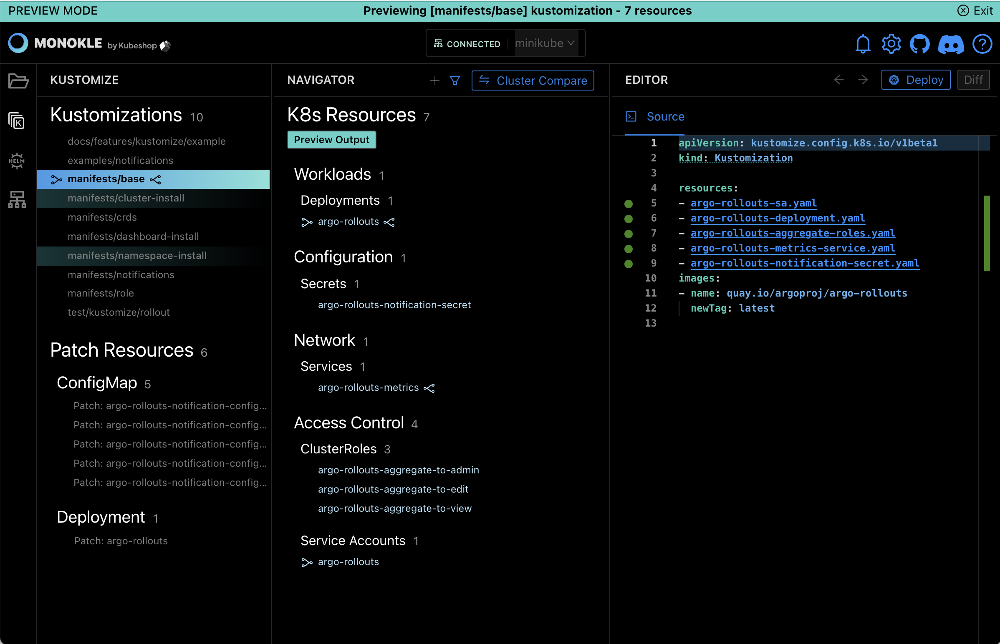
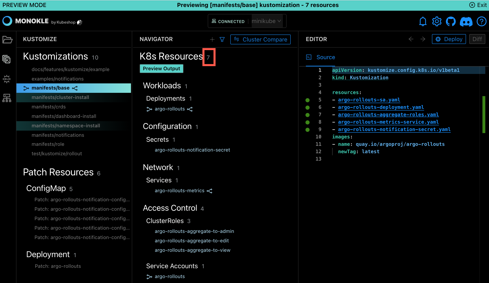
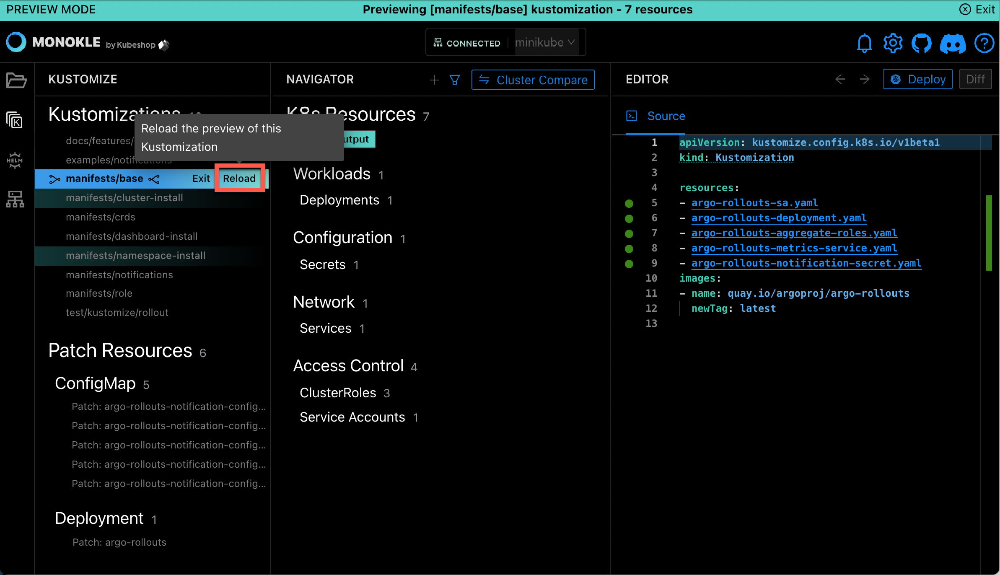

# Working with Kustomize 

Monokle has built-in support for [Kustomize](https://kustomize.io/) - a popular tool for managing kubernetes configurations:

- Monokle can visualize dependencies and relationships between kustomize files to help you understand the scope of
  a specific kustomization.
- Monokle can preview resources generated by Kustomize, helping you debug your configurations before you deploy them to 
  your cluster (requires kubectl to be installed and configured in your PATH).

All examples below are from the [Argo Rollouts manifest folder](https://github.com/argoproj/argo-rollouts/tree/master/manifests) - clone and try these yourself!

## Kustomize Navigation

When selecting a folder containing kustomization.yaml files, these will automatically be displayed in a "Kustomizations" section 
on top of the Navigator:

In the screenshot:

- The Kustomizations section shows all kustomization.yaml files - named after the folder they are in relative to the selected root folder.
- The "base" kustomization.yaml has been selected
    - The corresponding kustomization.yaml file has been highlighted to the left.
    - All "downstream" kustomizations and included resources are highlighted in the Navigator, helping you understand the "scope" of the selected kustomization.
    - The content of the kustomzation resource is shown in the Source editor to the right, with corresponding resource links marked in the code.

Just as with K8s resources, hovering over the link-icon to the right of the kustomization name shows its outgoing links:

(here we can see the 10 resources included by the selected kustomization)

Hovering the link-icon to the left of the kustomization name shows its incoming links:

  

Here we see two "upstream" kustomizations that include the selected kustomization in their configuration.

## Kustomize Preview 

While the above helps you understand the relationships and dependencies between kustomizations and their included resources, the
Preview functionality helps you understand what resources would be installed in your cluster when running kustomize.

Hovering over a kustomization reveals a "Preview" action to the right:

Selecting this action will run kustomize on the selected file with the "-k" option and replace the contents of the Navigator with the 
generated resources.  

For example previewing the "base" kustomization above will result in the following:

Monokle is now in "Preview Mode" (as indicated by the header at the top):

- The File Explorer has been disabled.
- The Navigator now contains all resources generated by running Kustomize with the "base" kustomization:
    - Resource navigation works as with files; selecting a resource shows its content in the source editor in read-only mode.
    - Resource links are shown as before with corresponding popups/links/etc.
- Selecting "Preview" for a different kustomization will switch the output of kustomize to that resource instead.
- Selecting "Exit" in the top right or next to the kustomization restores the previous resource navigator.

In the screenshot we can see that the selected kustomization resulted in 7 resources that contain references to the image
specified in the kustomization configuration:

## Editing of kustomizations during preview

When previewing a kustomization it is possible to edit the previewed kustomization.yaml file and recreate the preview, allowing 
you to quickly assess the impact of any changes on the generated files, instead of having to exit and recreate the preview to make a change.
 

