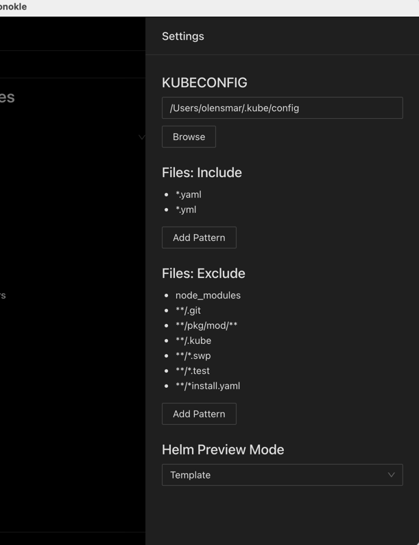

# UI Overview

Monokle is layed out like many other desktop applications:

Left to right:

- The vertical toolbar to the far left  allows you to switch between File and Cluster mode.
- The File Explorer (shown in screenshot) shows the contents of the currently selected folder.
- The Navigator in the center shows all resources found in the current folder or cluster. By default it shows all possible
  Resource sections and subsections - when selecting a folder or cluster only those sections that actually contain
  any resources will be shown.
- The Editor section to the right contains editors/views/actions for the currently selected resource or file

The top right contains two buttons
- Settings (see below)
- GitHub -> opens the Monokle GitHub repo in your system browser.

## Settings 

Clicking the Settings icon on the top right opens the settings:

- **Kubeconfig**: sets which kubeconfig Monokle should use for all cluster interactions
- **Files: Include**: which files to parse for kubernetes resources when scanning folders
- **Files: Exclude**: which files/folders to exclude when scanning folders for resources
- **Helm Preview Mode**: which Helm command to use for generating previews:
  - Template: uses [Helm Template](https://helm.sh/docs/helm/helm_template/)
  - Install: uses [Helm Install](https://helm.sh/docs/helm/helm_install/)
