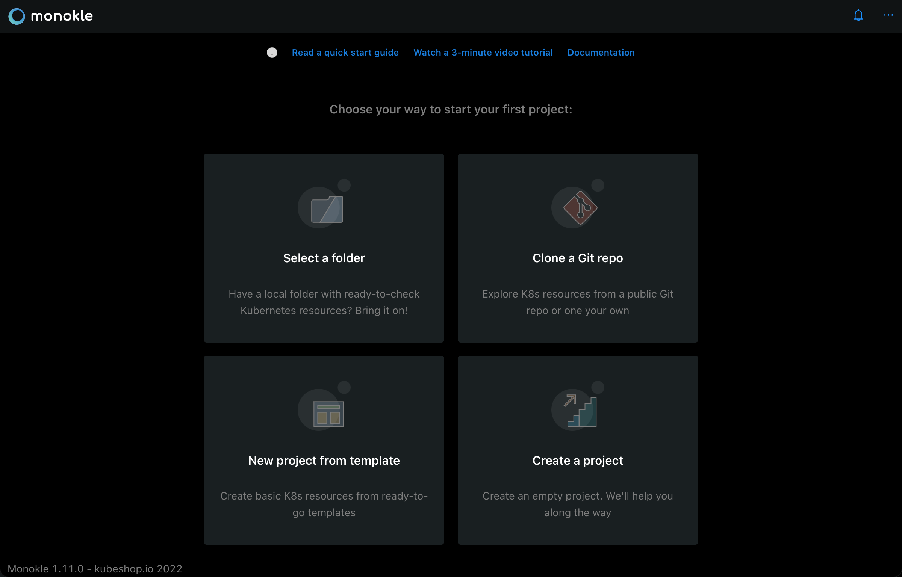
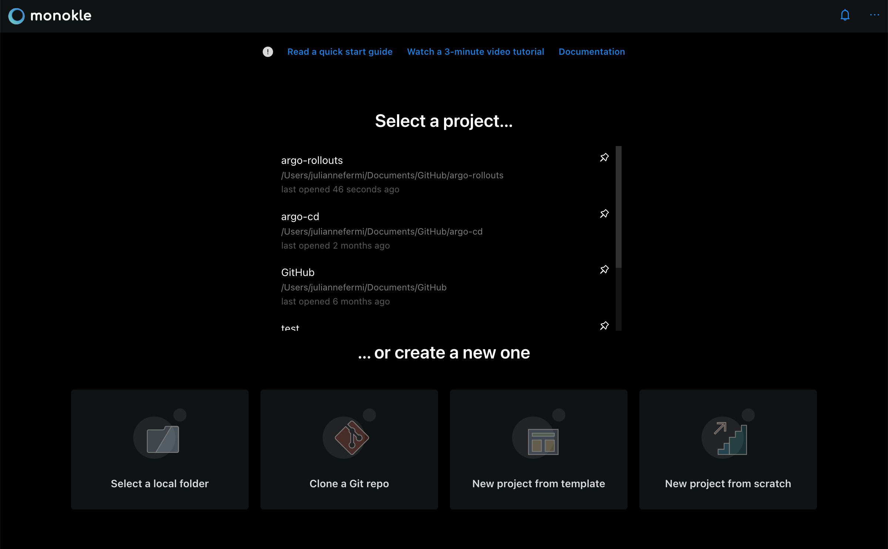
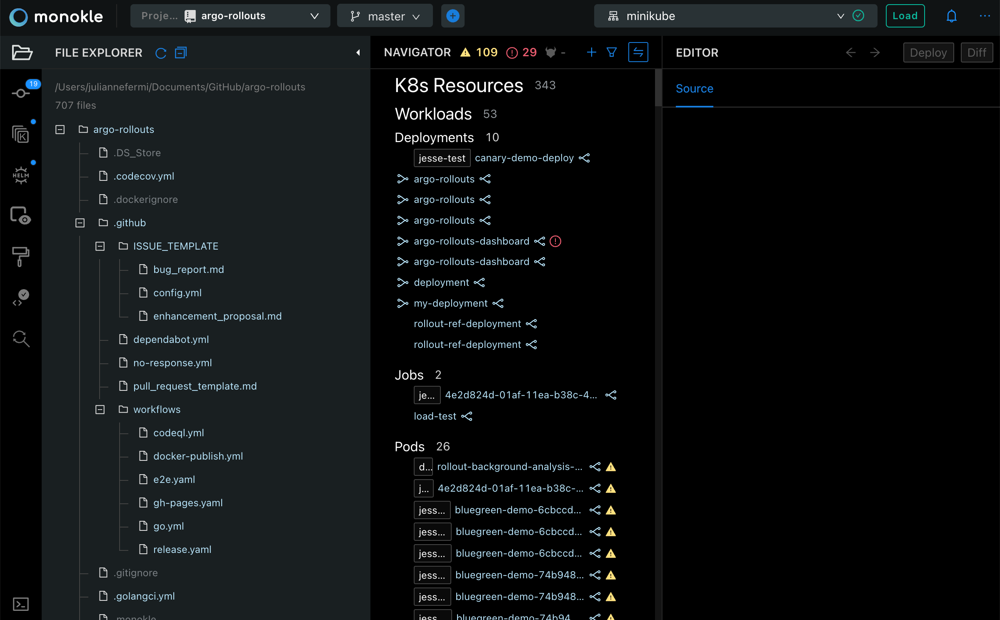
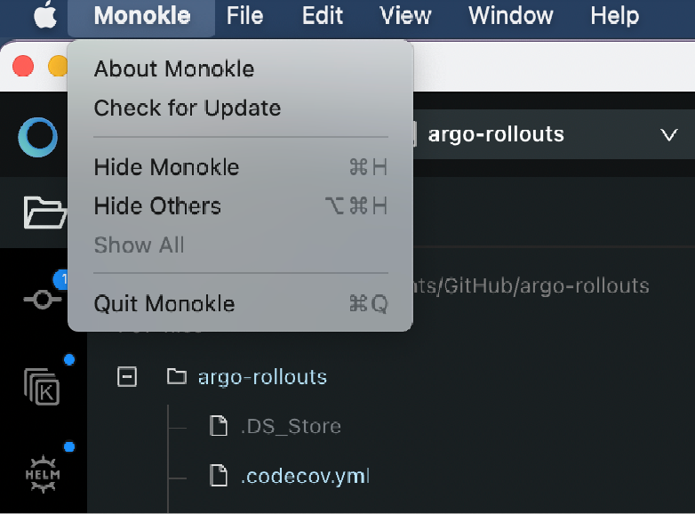

# UI Overview

## **Launch Monokle**

<em>**Note:** Please follow this [Getting Started](getting-started.md) guide to install Monokle 🚀</em>

Launch Monokle and, on the welcome screen, there are three options to start working with projects:

 - Select a folder with K8s resources.
 - Create a project from scratch.
 - Start from a template.
 

On subsequent start-ups, Monokle automatically loads the most recently selected folder, if the corresponding "Load recent folder on Startup" setting has been enabled:

## **Working with Projects**

Click **Select an existing folder** to add your project folder containing K8 resources. 

Monokle is laid out like many other desktop applications:

Left to right:

- The vertical toolbar to the far left allows you to switch between File, Kustomize, Helm and View Template mode.
- The File Explorer (shown in screenshot) shows the contents of the currently selected folder.
- The Navigator in the center shows all resources found in the current folder or cluster. By default it shows all possible
  Resource sections and subsections - when selecting a folder or cluster only those sections that actually contain
  any resources will be shown.
- The Editor section to the right contains editors/views/actions for the currently selected resource or file.

The top right contains the following buttons:

- The currently configured cluster.
- Show Latest Notifications
- An ellipsis with the following selections:
    - **Settings** -> See **Settings** section below.
    - **Plugins Manager** -> See our [Plugins](plugins.md) documentation for details.
    - **Help**
      - **Keyboard Shortcuts** -> See [Monokle Keyboard Shortcuts](hotkeys.md) for a complete list of keyboard shortcuts.
      - **Documentation** -> opens the Monokle documentation in your system browser.
      - **New in (Latest Version)** -> See the most recent updates.
      - **Replay Quick Guide** - Replay the Quick Guide pop ups for Monokle screen navigation.
      - **GitHub** -> opens the Monokle GitHub repo in your system browser.
      - **Discord** -> Opens Discord to talk to us about your Monokle experience.
      - **About Monokle** -> Details about the current version of Monokle.
  - **Feedback** -> Our feedback survey.

## **Settings**

Clicking **Settings** in the ellipsis drop down on the top right opens the settings modal:

   
### **Active Project Settings**
  - **Project Name**
  - **Kubernetes Version**: Sets Kubernetes' schema version for validation.
  - **Kubeconfig**: Sets which kubeconfig Monokle should use for all cluster interactions.
  - **Files: Include**: Sets which files to parse for kubernetes resources when scanning folders.
  - **Files: Exclude**: Sets which files/folders to exclude when scanning folders for resources.
  - **Helm Preview Mode**: Sets which Helm command to use for generating previews (see [Working with Helm Charts](helm.md)).
    - Template: uses [Helm Template](https://helm.sh/docs/helm/helm_template/)
    - Install: uses [Helm Install](https://helm.sh/docs/helm/helm_install/)
  - **Kustomize Command**: Sets how to invoke kustomize when previewing and applying kustomization file.
    - Use kubectl
    - Use kustomize
  - **Maximum folder-read recursion depth**: Configures how "deep" Monokle will parse a specified folder (to avoid going too deep).
  - **Resource links processing**:
    - Ignore optional unsatisfied links.
  - **Form Editor**
    - Create default objects
    - Set default primitive values
  - **Cluster Mode**
    - Allow editing resources

### **Default Project Settings**  
  - **Kubeconfig**: Sets which kubeconfig Monokle should use for all cluster interactions.
  - **Files: Include**: Sets which files to parse for kubernetes resources when scanning folders.
  - **Files: Exclude**: Sets which files/folders to exclude when scanning folders for resources.
  - **Helm Preview Mode**: Sets which Helm command to use for generating previews (see [Working with Helm Charts](helm.md)).
    - Template: uses [Helm Template](https://helm.sh/docs/helm/helm_template/)
    - Install: uses [Helm Install](https://helm.sh/docs/helm/helm_install/)
  - **Kustomize Command**: Sets how to invoke kustomize when previewing and applying kustomization file.
    - Use kubectl
    - Use kustomize
  - **Maximum folder-read recursion depth**: Configures how "deep" Monokle will parse a specified folder (to avoid going too deep).
  - **Resource links processing**:
    - Ignore optional unsatisfied links.
  - **Form Editor**
    - Create default objects
    - Set default primitive values
  - **Cluster Mode**
    - Allow editing resources
    

### **Global Settings** 
  - **Projects Root Path**
  - **On Startup**: 
    - Automatically load last project.
    - Show Cluster Selector.
  - **Telemetry**:
    - Disable Usage Data
    - Disable Error Reports

## **System Menu**

Monokle provides a system menu with the common File/Edit/View/Window/Help functionality.

Mac System Menu:

Windows System Menu:

## **Multiple Windows**

You can launch multiple project windows using the New Monokle Windows option. This allows you to work on multiple folders or clusters simultaneously. Thus visual navigation for the recently used pages becomes simpler and faster.

**Action:** File > New Monokle Window

## **Auto-update**

The Monokle (on Mac) / Help (on Windows) system menus provide a "Check for Update" action that will check for an update
and prompt to download, if available.

