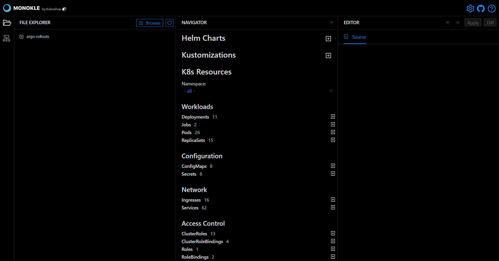
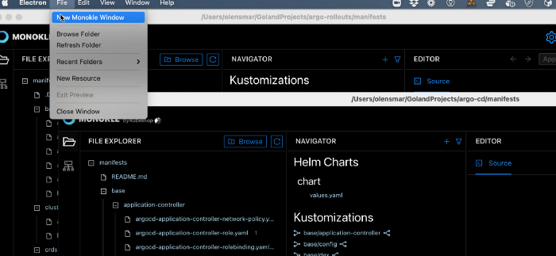
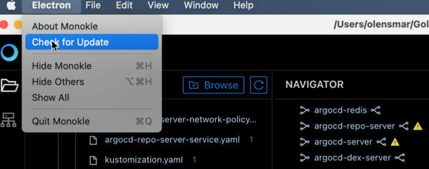

# UI Overview

Monokle is layed out like many other desktop applications:

Left to right:

- The vertical toolbar to the far left  allows you to switch between File and Cluster mode.
- The File Explorer (shown in screenshot) shows the contents of the currently selected folder.
- The Navigator in the center shows all resources found in the current folder or cluster. By default it shows all possible
  Resource sections and subsections - when selecting a folder or cluster only those sections that actually contain
  any resources will be shown.
- The Editor section to the right contains editors/views/actions for the currently selected resource or file

The top right contains the following buttons

- Settings (see below)
- GitHub -> opens the Monokle GitHub repo in your system browser.
- Help -> opens the Monokle documentation in your system browser

## Settings 

Clicking the Settings icon on the top right opens the settings:

- **Kubeconfig**: sets which kubeconfig Monokle should use for all cluster interactions
- **Files: Include**: which files to parse for kubernetes resources when scanning folders
- **Files: Exclude**: which files/folders to exclude when scanning folders for resources
- **Helm Preview Mode**: which Helm command to use for generating previews (see [Working with Helm Charts](helm.md))
    - Template: uses [Helm Template](https://helm.sh/docs/helm/helm_template/)
    - Install: uses [Helm Install](https://helm.sh/docs/helm/helm_install/)
- **On Startup**: 
    - Automatically load last folder: will do just that on startup!
- **Maximum folder-read recursion depth**: configures how "deep" Monokle will parse a specified folder (to avoid going too deep)

## System Menu

Monokle provides a system menu with common File/Edit/View/Window/Help functionality

Mac System Menu:

Windows System Menu: 

## Multiple Windows

You can launch multiple project windows using the New Monokle Windows option. It allows you to work on multiple folders or clusters simultaneously. Thus visual navigation for the recently used pages becomes simpler and faster.   

**Action:** File > New Monokle Window

## Keyboard Shortcuts

Monokle current supports the following keyboard shortcuts:

- Cluster Preview: Ctrl/Cmd I
- Settings: Ctrl/Cmd P
- Exit Preview: ESC
- Browse Folder: Ctrl/Cmd O
- Refresh Folder: Ctrl/Cmd F5
- Toggle Left Pane: Ctrl/Cmd B
- Toggle Right Pane: Ctrl/Cmd ALT B
- Save (in editors): Ctrl/Cmd S
- Navigate Back (Selection History): ALT ArrowLeft
- Navigate Forward (Selection History): ALT ArrowRight
- Open New Resource Wizard: Ctrl/Cmd N
- Apply Resource or File to cluster: Ctrl/Cmd ALT S
- Diff Resource: Ctrl/Cmd ALT D

## Auto-update

The Monokle (on Mac) / Help (on Windows) system menus provide a "Check for Udpate" action that will check for an update
and prompt to download if available.

