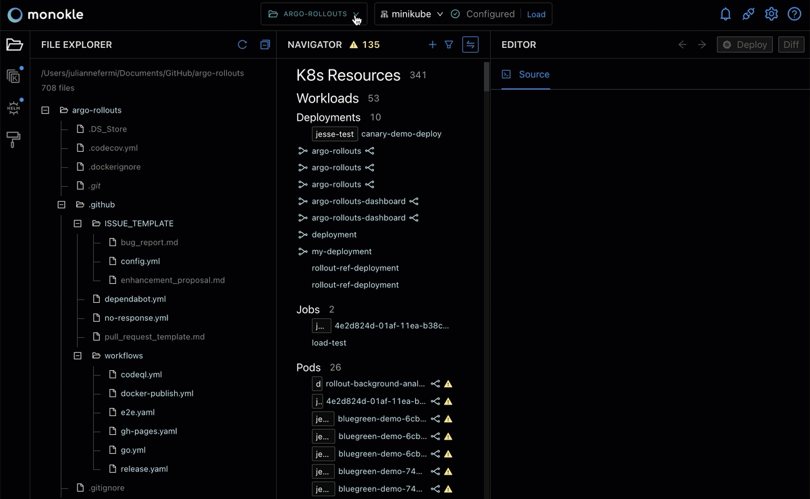

# Working with Projects

## **Launch Monokle**

<em>**Note:** Please follow this [Getting Started](getting-started.md) guide to install Monokle 🚀</em>

Launch Monokle and, on the welcome screen, there are three options to start working with projects:

 - Select an exisiting folder.
 - Create an empty project.
 - Start from a template.
 

Click **Select an existing folder** and navigate to an existing project folder containing K8 resources. 

## **Select and Manage a Project**

After a project is opened in Monokle, the project selector at the top of the screen will denote the project that is being displayed in the IDE.

Use this selector to open a new project or switch in between projects:

## **Manage Multiple Projects**

Easily switch in between projects to more efficiently work with multiple projects at the same time.
