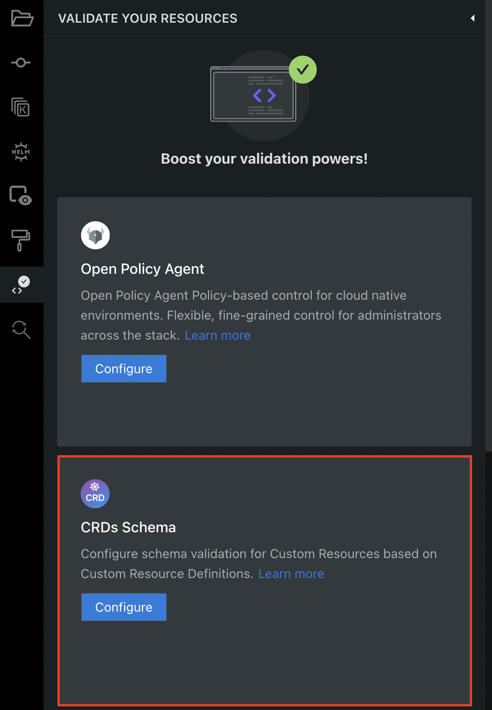
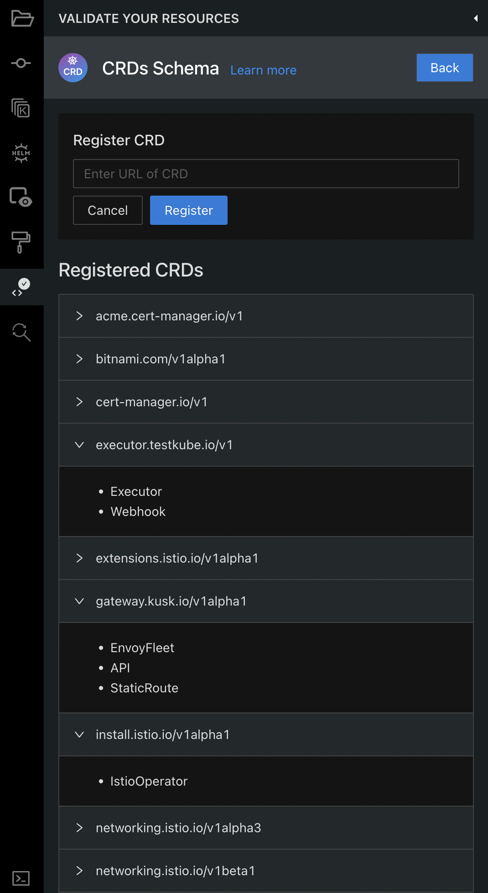

# Custom Resource Definitions

The CustomResourceDefinition API resource allows you to define custom resources.   
Defining a CRD object creates a new custom resource with a name and schema that you specify.  
The Kubernetes API serves and handles the storage of your custom resource.  
[Read more about CRDs here](https://kubernetes.io/docs/concepts/extend-kubernetes/api-extension/custom-resources/#customresourcedefinitions)

## How are CRDs used by Monokle?

Monokle uses the CRDs to be able to recognize the Custom Resources that you're creating.  
By default, any Custom Resource that does not have a CRD registered in Monokle, will show up in the Navigator under the "Unknown Resources" section.  

After registering a CRD, Monokle will do the following:  
  - Validate Custom Resources based on the schema provided by the CRD  
  - Generate Form Editors based on the CRD schema  
  - Enable Cluster interactions on the Custom Resources  

## How can you register a CRD?

There are 2 ways:

1. Load the objects from a Cluster.  
Monokle will scan the resources and if it finds a CRD, it will register it so it can later recognize the Custom Resources.

2. Use the CRDs Schema panel from the Validation tab.  
This panel lists all the CRDs that are already registered in Monokle and you can register new CRDs by providing a URL pointing to YAML content.

