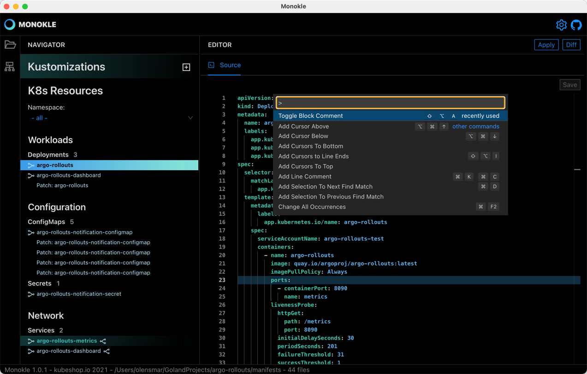
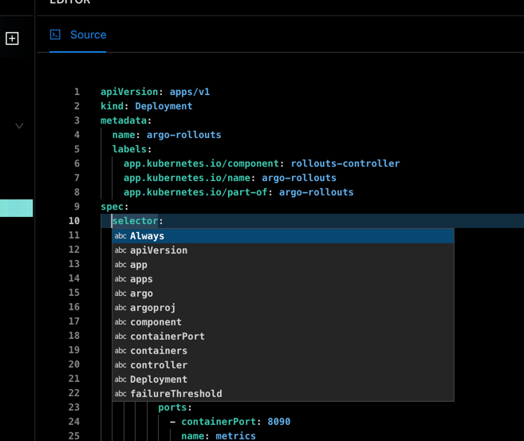
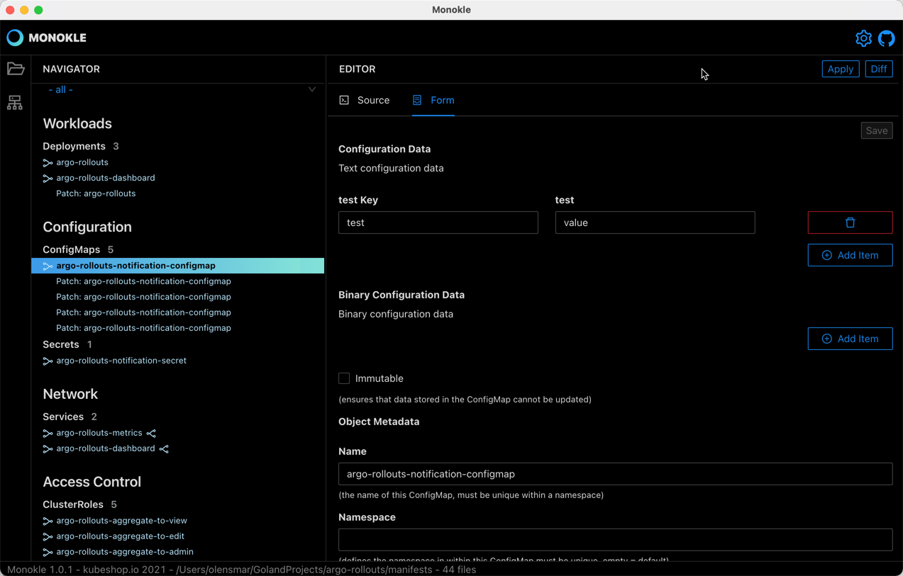

# Editing

## Source Editor

Selecting either a file or resource will show its contents in the source editor to the right. The editor will syntax-highlight for
yaml only at this point.

Right-clicking in the editor shows a list of available commands - and pressing F1 opens its command-palette:

### Editing Resources

When editing resources (not files) the editor is schema-aware for all native Kubernetes resources, which provides
auto-complete (Ctrl-Space) and context-sensitive hover documentation

#### Resource Links

Resource links are marked in the gutter and underlined in the editor, with corresponding hover/popup windows to show linked resources:

Broken links are shown with yellow triangles as in the Navigator:

#### Saving changes

The [Save] button on top of the editor will be enabled if valid changes have been made - invalid yaml will not be savable.
Saving a resource will update the containing file correspondingly and recalculate all affected ingoing/outging links for
the resource.

### Editing Files

When editing files directly by selecting them in the File Explorer the editor will at this point not show any links or provide 
context-sensitive editing functionality.

## Form Editor

To start with Monokle only shows a Form Editor for ConfigMap resources:

The editor provides form fields for key ConfigMap properties, allowing you to edit/discover all available properties without 
having to learn or lookup the corresponding resource documentation. Any changes made and saved (with the Save button on the top right)
are written back to the underlying yaml.
