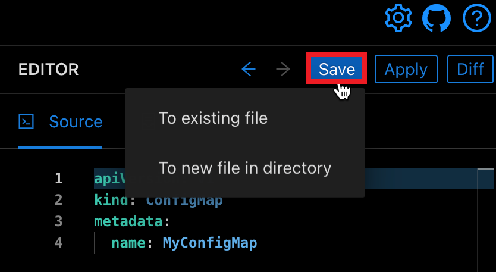

# Editing Resources

Monokle allows you to edit resource manifests either in a Source Editor or a Form-based Editor which hides the underlying YAML complexity.

<!--- ## **Source Editor**

Selecting either a file or resource will show its contents in the Source Editor to the right. The editor will syntax-highlight for
YAML and provide context-sensitive help and auto-complete functionality for standard Kubernetes objects.

Right-clicking in the editor shows a list of available commands. Pressing F1 opens its command-palette:

 -->

## **Editing Resources**

When editing resources (not files), the editor is schema-aware for all native Kubernetes resources, which provides
auto-complete (Ctrl-Space) and context-sensitive hover documentation.

When editing a resource, click on the document icon at the top right of the Editor pane to open the corresponding Kubernetes documentation in a browser window:

 

<!---### **Resource Links**

Resource links are marked in the gutter and underlined in the Editor, with corresponding hover/popup windows to show linked resources:

Broken links are shown with yellow triangles in the Editor as in the Navigator:

While hovering over a broken link in the Editor, a pop-up window will allow you to create that resource:

-->

## **Working with Multiple Resources**

Select multiple resources by clicking the checkbox to the left of the resource name. Below, two resources are selected and the **Delete** or **Deploy** actions are available for both resources.

 

## **Add a Resource**

While using Monokle, you can directly add new K8s resources. Once you have browsed and added your project folder, click on the **New Resource** button at the top of the navigator to launch the **Add New Resource** dialog.

For adding resources to new or existing files in the navigator, click on the Save button at the top-right corner of the interface.

While creating a resource, it is possible to select an existing resource as a template from the drop-down menu. 

## **Edit Resources in a Cluster**

You can easily view and edit resources from clusters. After making changes in a resource, you can quickly deploy them back to the cluster.

### **Saving Changes**

The **Save** button on top of the editor will be enabled only if valid changes have been made - invalid YAML will not be savable. Saving a resource will update the containing file correspondingly and recalculate all affected ingoing/outging links for
the resource.

## **Editing Files**

When editing files directly by selecting them in the File Explorer, the editor will not show any links or provide context-sensitive editing functionality.

<!---## **ConfigMap Properties Form**

In version 1.4.0, Monokle shows properties for ConfigMap resources only:

Clicking "ConfigMap" at the top of the Editor opens the  form fields editor for key ConfigMap properties, allowing you to edit/discover all available properties without 
having to learn or lookup the corresponding YAML/resource documentation. Any changes made and saved (with the Save button on the top right)
are written back to the underlying YAML. 

**Check out [this tutorial](tutorials/how-to-create-and-edit-configmap.md) for more details 
on how to use the Form Editor for ConfigMaps.**-->

## **Navigator Resource Options**

Click the ellipsis to the right of a resource name to see the options available:

Unknown Resources will display in the Navigator but only have the **Rename** and **Delete** options:

### **Rename a Resource**

You can rename resources and update all the references associated with that resource to ensure the integrity of that link.

### **Clone a Resource**

You can use the Clone action to create a new resource by using existing resources as a template. 

### **Delete a Resource**

You can use the Delete action in the cluster mode to delete the resource from the actual cluster. 

## **Secret Resources**

Kubernetes secret resources are shown in the Navigator. A **Secret** is an object storing sensitive pieces of data such as usernames, passwords, tokens, and keys.

Highlight the secret resource in the Navigator and the source will be displayed in the Editor pane. There, you can hover over the encoded secret value to see the decoded value (for **username** in the example below):

