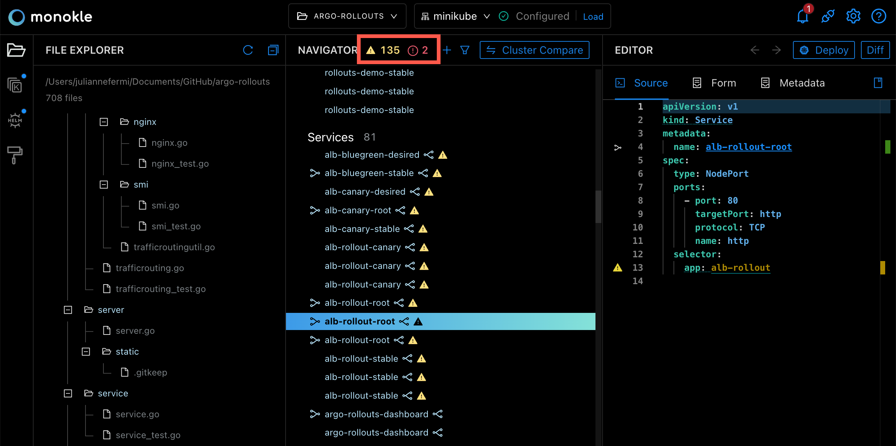
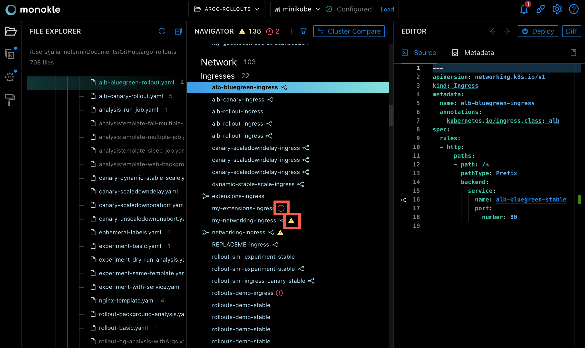

# Validating Resources

Monokle automatically validates all resources of the corresponding Kubernetes 1.22.1 schemas. In the Navigator, a resource which is not validated is shown with a red error icon. A resource with a broken link is shown with a yellow triangle. 

## **Inspecting Link and Syntax Validation Errors**

You will see the number of both link and syntax validation errors in resources at the top of the Navigator:

Click on the yellow triangle to see a list of the broken links in the current resources:

Click on the red circle to see a list of syntax errors in the current resources:

Clicking on any item in the broken link or syntax error list will locate the file where the error exits in the Navigator and open the source in the Editor.  

This same functionality is available when the error icons are next to the file names in the Navigator:

Hover on the error icon to check the error details and see the corresponding line in the Editor:

