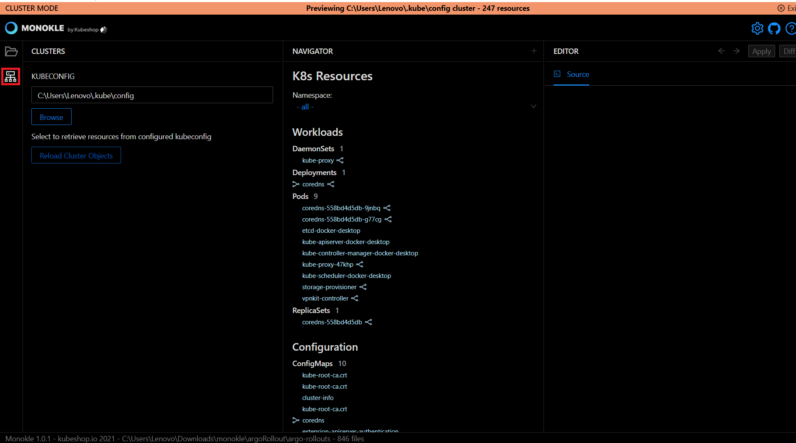
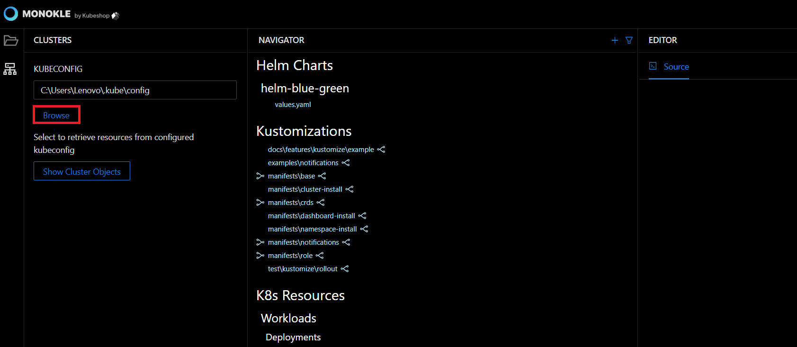
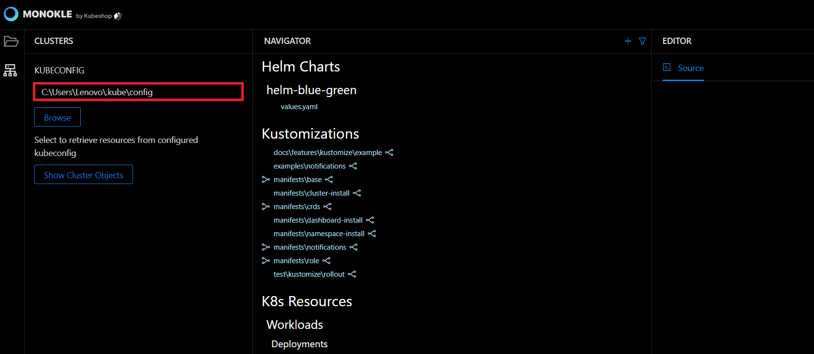
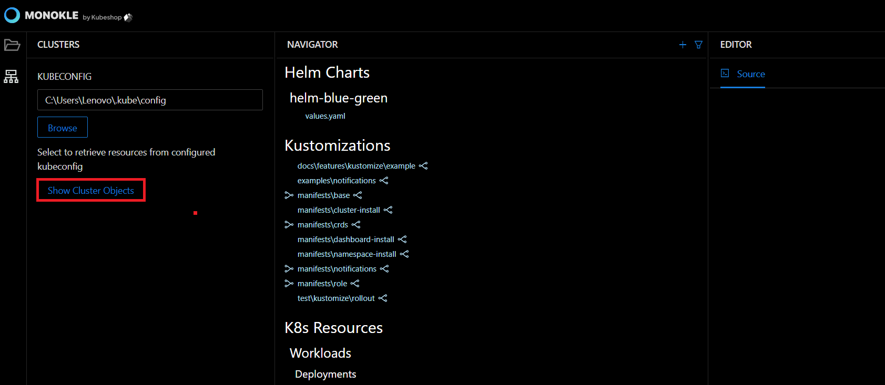
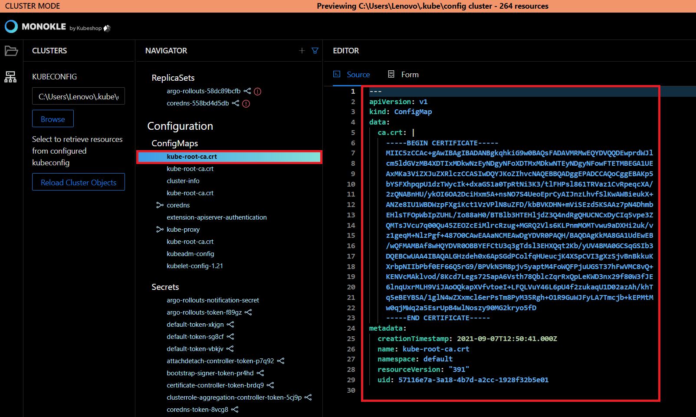
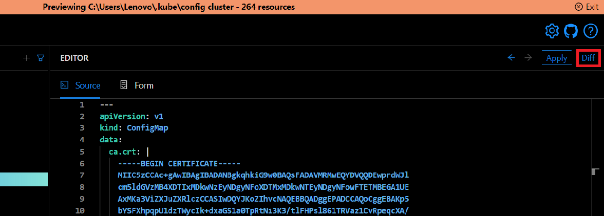
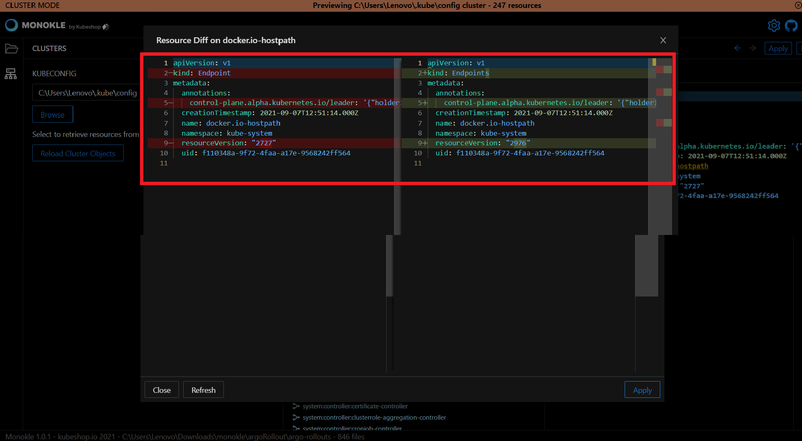
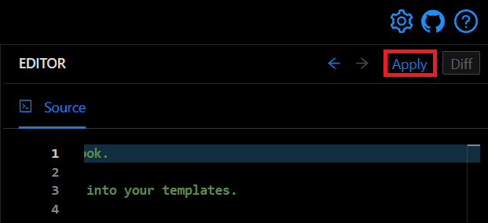
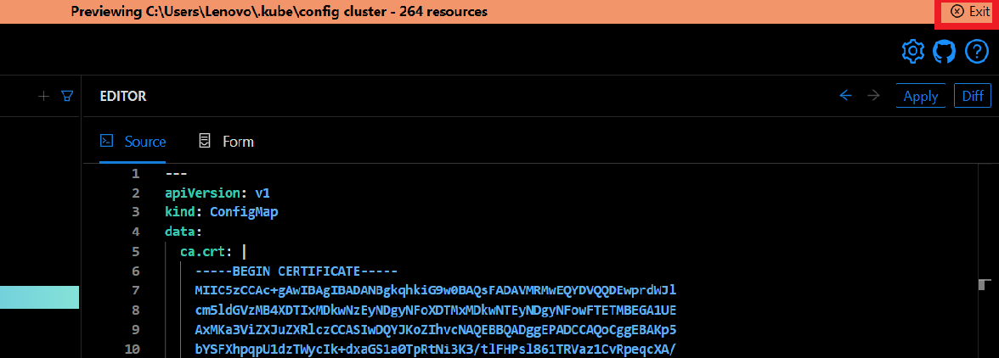

# How to Browse Clusters

In this Monokle tutorial, we will illustrate the steps to connect to a cluster and navigate/update contained resources.

Let’s get started. 

## 1. Select Cluster Preview
 
Launch Monokle and click on the Cluster Preview button in the file explorer.

## 2. Specify kubeconfig

Click on the Browse button to fetch the kubeconfig file for configuring cluster access. 

 

Alternatively, you can also enter the kubeconfig file path manually in the KUBECONFIG text field. 

 

<em>**Note:** The kubectl command-line tool uses kubeconfig files to find the information it needs to choose a cluster and communicate with the API server.</em>

## 3. Retrieve Cluster objects

Click on the Show Cluster Objects button to launch the resources in the configured cluster. 

 

Monokle will switch to the Cluster-Mode, and the Navigator will reflect all the resources retrieved from the configured cluster. 

## 4. Navigate / Select resources

Select a resource to view its source code in the source editor. You can edit resources in cluster-mode, allowing you to make quick changes and apply them back to your cluster

 

## 5. Diff changes against Cluster

Click the Diff button to analyze and compare the selected resource against the currently configured cluster.

The comparison table will look like this:

## 6. Apply changes

Click on the Apply button to update the resource to the currently configured cluster.

Resource applied will be shown in the top-right corner of the console.

## 7. Exit Cluster mode

Click on the Exit button on the top-right corner of the console to restore the resources of the currently selected folder. 

 

Thus you can browse cluster resources. 

Got queries? Please feel free to join our open source community on Discord with this [invite link](https://discord.gg/6zupCZFQbe) and start your discussion.
