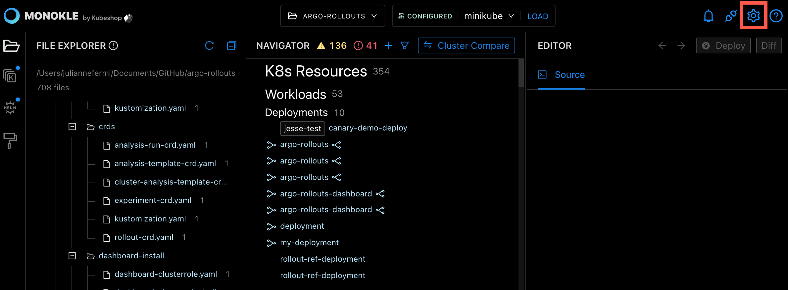
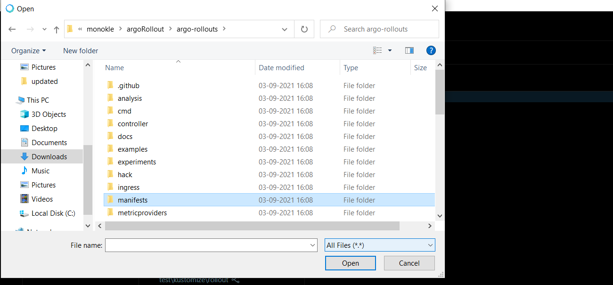
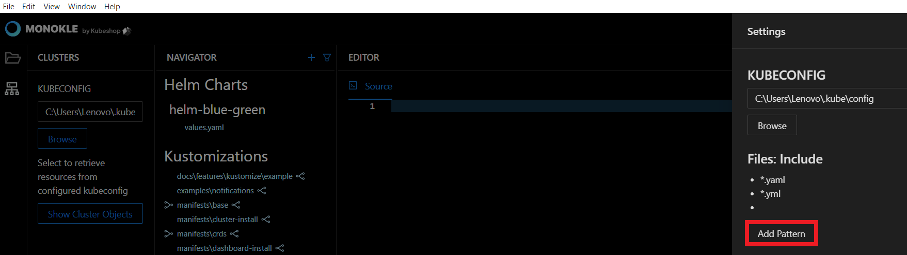
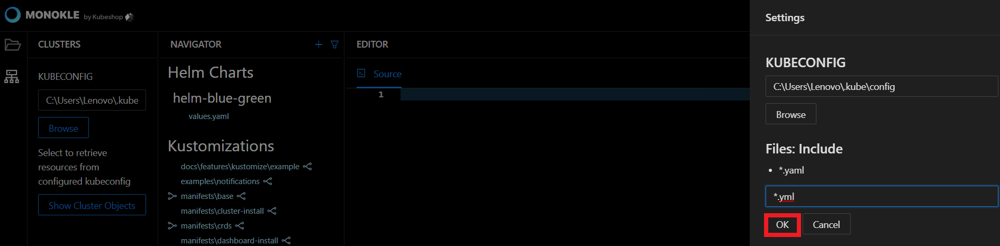
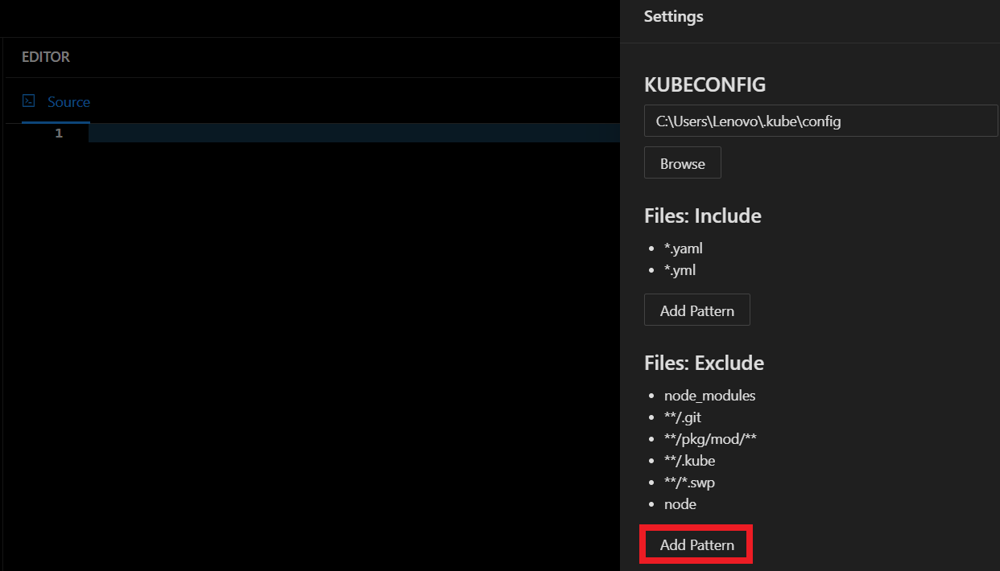
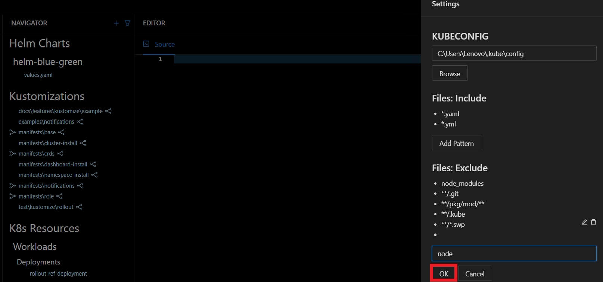
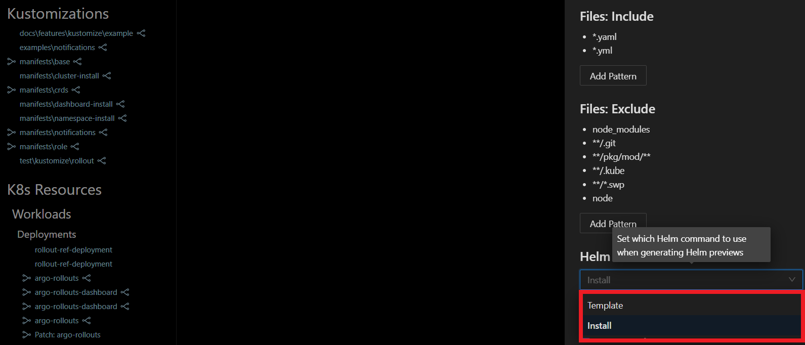
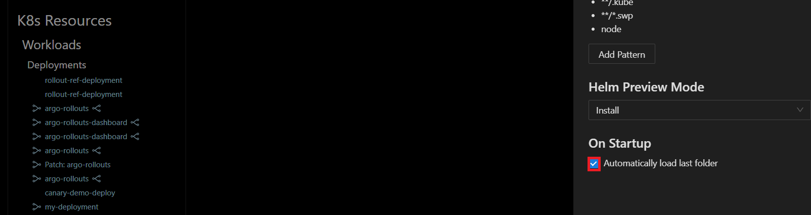

# How to Configure Monokle

In this tutorial, we will show the steps to configure Monokle Environment. 

<em>**Note:** All settings are initialised with default values - there is no immediate need to change them. </em>

Let’s get started! 

## **1. Open Settings**

Launch Monokle and click on the **Settings** button to open the Settings widget:

## **2. Set kubeconfig**

Enter the kubeconfig file path in the KUBECONFIG text field. The kubeconfig parameter is used when viewing cluster
resources and deploying/diffing local resources to a cluster.

Alternatively, you can click on the **Browse** button to fetch the kubeconfig file for configuring cluster access. 

Select the required folder to config the cluster. 

<em>**Note:** The kubectl command-line tool uses kubeconfig files to find the information for choosing a cluster and communicating with the API server.</em>

## **3. Files: Include**

Monokle will look for kubernetes manifests in files matching this filter, by default this is set to *.yaml/*.yml files.
Click on the **Add Pattern button** to include the files having the corresponding extension.

Enter the extension pattern in the files include textbox and hit the OK button. 

## **4. Files: Exclude**

Monokle will ignore files/folders matching any of the specified paths (even if they match an above inclusion pattern),
Click on the Add Pattern button to exclude the files having the corresponding extension. For example, node_modules.

Enter the extension pattern in the files exclude textbox and hit the OK button. 

## **5. Helm Preview Mode**

Click on Helm Preview Mode dropdown to select any of the viewing states. The options for preview:

- **Template** - To use the [Helm template command](https://helm.sh/docs/helm/helm_template/)
- **Install** - To use the [Helm Install command](https://helm.sh/docs/helm/helm_install/)

## **6. On Startup**

Tick the Automatically Load Last Folder checkbox to reload the last reviewed folder when launching Monokle. 

## **Questions or Comments?**

Please feel free to join our open source community on Discord with this [Invite Link](https://discord.gg/6zupCZFQbe) and start your discussion.
