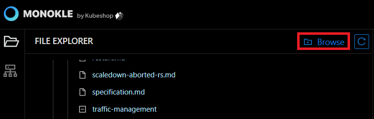
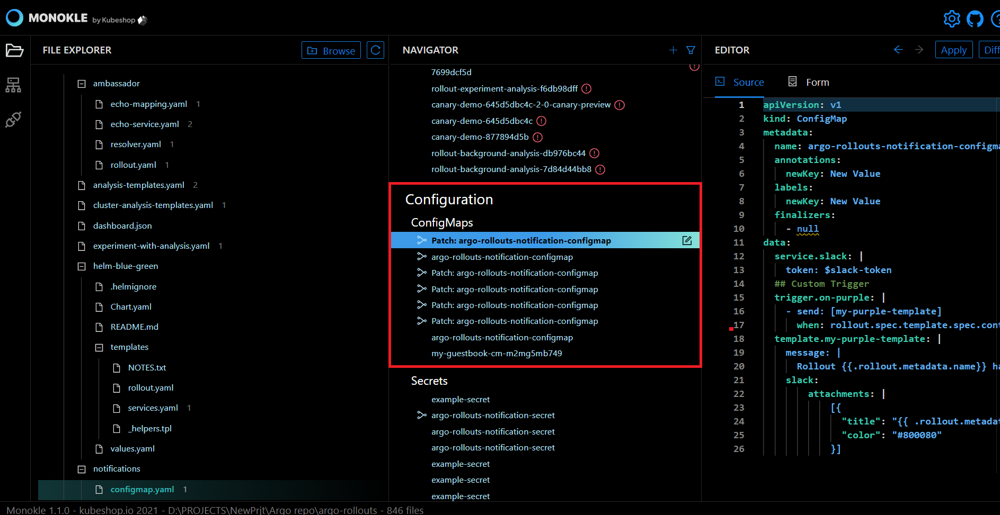
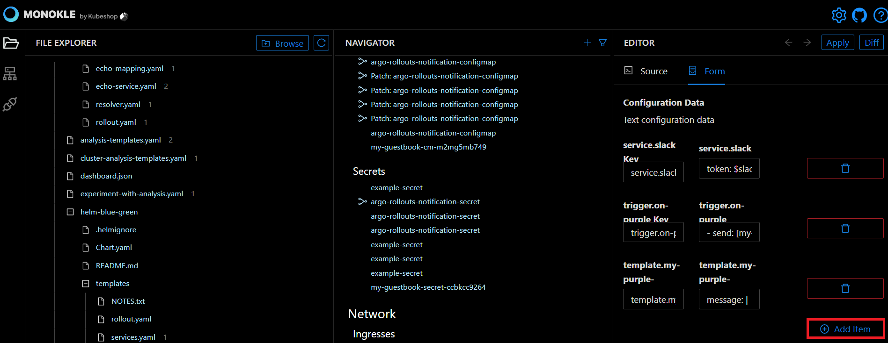
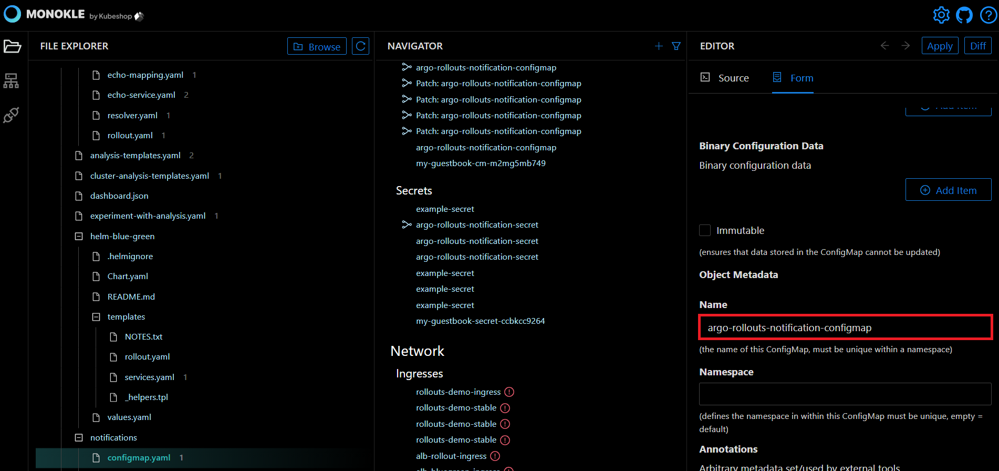

# How to Create and Edit ConfigMap 

Monokle is a fully integrated IDE for managing manifests. It provides instant access for debugging Kubernetes resources without looking into the YAML syntax. 

In this tutorial, we have illustrated how to create and edit ConfigMap resources to store non-confidential data in key-value pairs.       

Let’s get started. 

**Step 1:** Launch Monokle and click on the Browse button to add your project folder containing K8 resources. 

<em>**Note:** Please follow this [Getting Started](../getting-started.md) guide to install Monokle 🚀</em>

**Step 2:** Select your folder to parse its manifest in the file explorer. 

In the file explorer, you can view manifests, including their resources, and their relationships.

**Step 3:** Scroll up & down to navigate and select the required manifests. 

Once you select a manifest, its related resources shall be highlighted automatically in the navigator. 
## Create Resource

**Step 1:** Click on the Add button in the Navigator to launch the Add New Resource dialog for creating resources. 

**Step 2:** For adding resources to new or existing files in the navigator, click on the Save button at the top-right corner of the interface.

## Using Source Editor 

**Step 1:** Navigate and select the ConfigMap resources in the Navigator.  

Once you select a resource, its source code will be launched automatically in the source editor. 

The Source Editor allows you to view and edit the source code easily. 

**Step 2:** Click on the Source button to view and edit the source code. 

**Step 3:** Right-click anywhere on the source editor to launch the menu and select the required editing option from the drop-down list. 

You can also edit the source code using the Form Editor that does not require any coding effort. 
## Using the Form Editor

The form editor collects the required information and passes it to another entity. To launch the form editor, click on the Form button. 

### For Configuration Data

**Step 1:** Click on the Add Item button to create a new text field for data configuration.

**Step 2:** Enter the text configuration data in key-value pair fields.

<em>**Note:** You can also edit the existing data in the key-value pair fields.</em>

### For Binary Configuration Data 

**Step 1:** Click on the Add Item button to create a new binary data field for binary data configuration.

**Step 2:** Enter the binary configuration data in key-value pair fields.

<em>**Note:** You can also edit the existing binary configuration data in the fields.</em> 

**Step 3:** Tick the Immutable checkbox to ensure the data stored in the ConfigMap is not updated. 

Now you can start editing the object metadata. 
### Object Metadata

For editing object metadata you need to provide a specific name, namespace, annotations, labels, cluster name, generate name, and finalizers to uniquely identify the object.  
### For Name

**Step 1:** Enter the specific key name in the name field to give a unique identity to the object.

<em>**Note:** The name of the ConfigMap must be unique within a namespace.</em>
### For Namespace

**Step 1:** Enter namespace in the namespace field to organize clusters into virtual sub-clusters. 

<em>**Note:** Provide a unique namespace within the ConfigMap. If left empty, then the default namespace value shall be assigned automatically.</em> 
### For Annotations

**Step 1:** Click on the Add Item button to create the new key-value field for annotations. 

**Step 2:** Enter the arbitrary metadata in key-value pair fields.

<em>**Note:** You can also edit the existing arbitrary metadata data in the fields.</em> 

### For Labels

**Step 1:** Click on Add Item button to create the new key-value field for labels.

**Step 2:** Enter the label's details in the key-value pair field.

<em>**Note:**  you also can edit the existing label data in the fields.</em> 

### For Cluster Name

Enter the name of the cluster in the cluster field to which the object belongs.

### For Generate Name

Enter a prefix in the Generate Name field.

<em>**Note:** You can also edit the existing data in the generate name fields.</em> 

### For Finalizers

**Step 1:** Click on the Add item button to create the new finalizer field.

**Step 2:** Enter the finalizer in the finalizers field. 

<em>**Note:** You also can edit the existing data in the finalizer fields.</em> 

It prompts Kubernetes to wait until specific conditions are met before it fully deletes resources marked for deletion.

<em>**Note:** Finalizer must be empty before the object is deleted from the registry.</em> 

The source editor provides autocomplete and autosave options, and hence you don’t have to manually save your edits. 
                 
Thus you can edit the ConfigMap. 

Got queries? Please feel free to join our open source community on Discord with this [invite link](https://discord.gg/6zupCZFQbe) and start your discussion. 
