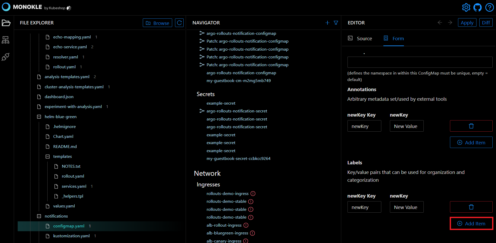

# How to Work with ConfigMaps

In this Monokle tutorial, we will illustrate how to create and edit ConfigMap resources to store non-confidential 
data in key-value pairs.       

Let’s get started! 

## **Launch Monokle**

<em>**Note:** Please follow this [Getting Started](../getting-started.md) guide to install Monokle 🚀</em>

Launch Monokle and, on the welcome screen, there are three options to start working with projects:

 - Select an exisiting folder.
 - Create an empty project.
 - Start from a template.
 
 Click **Select an existing project** to add your project folder containing K8 resources. 

## **Select Folder**

Select your folder to parse its manifest in the file explorer. 

In the file explorer, you can view manifests, including their resources and their relationships.

## **Select Manifests**

Scroll up and down to navigate and select the required manifests. 

Once you select a manifest, its related resources will be highlighted automatically in the navigator.

## **Create a New Resource**

Click on the **Add** button (plus sign) in the Navigator to launch the **Add New Resource** dialog for creating resources. 

At the bottom of the dialog, you can select the option to:
- Save to folder.
- Add to file.
- Don't save.

## **Use the Source Editor** 

**Step 1:** Navigate and select the ConfigMap resources in the Navigator.  

Once you select a resource, its source code will be launched automatically in the Source Editor. 

The Source Editor allows you to view and edit the source code easily. 

**Step 2:** Right click anywhere in the Source Editor to launch the menu to select the required editing option from the drop-down list.

You can also edit the source code using the Form Editor, which does not require any coding effort.

## **Using the ConfigMap Editor**

The ConfigMap Editor collects the required information and passes it to another entity. To launch the ConfigMap Editor, click on the **ConfigMap** button. 

### **For Configuration Data**

**Step 1:** Click on the **Add Item** button to create a new text field for data configuration.

**Step 2:** Enter the text configuration data in key-value pair fields.

<em>**Note:** You can also edit the existing data in the key-value pair fields.</em>

### **For Binary Configuration Data** 

**Step 1:** Click on the **Add Item** button to create a new binary data field for binary data configuration.

**Step 2:** Enter the binary configuration data in key-value pair fields.

<em>**Note:** You can also edit the existing binary configuration data in the fields.</em> 

**Step 3:** Tick the **Immutable** checkbox to ensure the data stored in the ConfigMap is not updated. 

## **Using the Object Metadata Editor**

To launch the Metadata Editor, click on the **Metadata** button.

For editing object metadata, you need to provide a specific name, namespace, annotations, labels, cluster name, generate name, and finalizers to uniquely identify the object.  

### **Name**

**Step 1:** Enter the specific key name in the name field to give a unique identity to the object.

<em>**Note:** The name of the ConfigMap must be unique within a namespace.</em>

### **Namespace**

**Step 1:** Enter namespace in the namespace field to organize clusters into virtual sub-clusters. 

<em>**Note:** Provide a unique namespace within the ConfigMap. If left empty, the default namespace value shall be assigned automatically.</em> 

### **Annotations**

**Step 1:** Click on the **Add Item** button to create the new key-value field for annotations. 

**Step 2:** Enter the arbitrary metadata in key-value pair fields.

<em>**Note:** You can also edit the existing arbitrary metadata data in the fields.</em> 

### **Labels**

**Step 1:** Click on **Add Item** button to create the new key-value field for labels.

**Step 2:** Enter the label's details in the key-value pair field.

<em>**Note:**  You also can edit existing label data in the fields.</em> 

### **Cluster Name**

Enter the name of the cluster in the **Cluster Name** field to which the object belongs.

### **Generate Name**

Enter a prefix in the **Generate Name** field.

<em>**Note:** You can also edit the existing data in the **Generate Name** field.</em> 

### **Finalizers**

**Step 1:** Click on the **Add Item** button to create the new finalizer field.

**Step 2:** Enter the finalizer in the finalizers field. 

<em>**Note:** You also can edit the existing data in the finalizer fields.</em> 

Kubernetes is prompted to wait until specific conditions are met before it fully deletes resources marked for deletion.

<em>**Note:** Finalizer must be empty before the object is deleted from the registry.</em> 

The source editor provides autocomplete and autosave options to automatically save your edits. 
                 
## **Questions or Comments?**

Please feel free to join our open source community on Discord with this [Invite Link](https://discord.gg/6zupCZFQbe) and start your discussion. 
