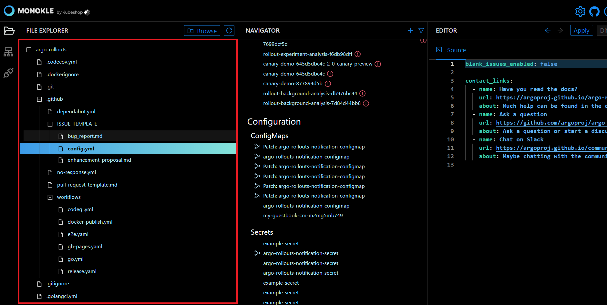
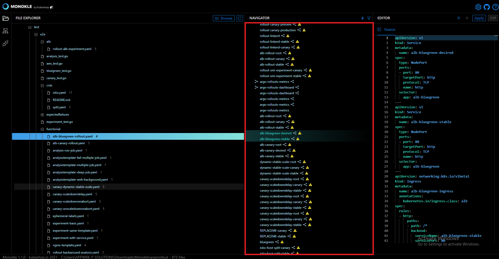
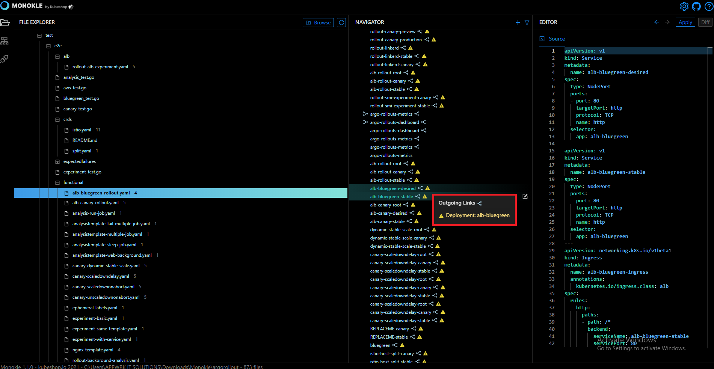
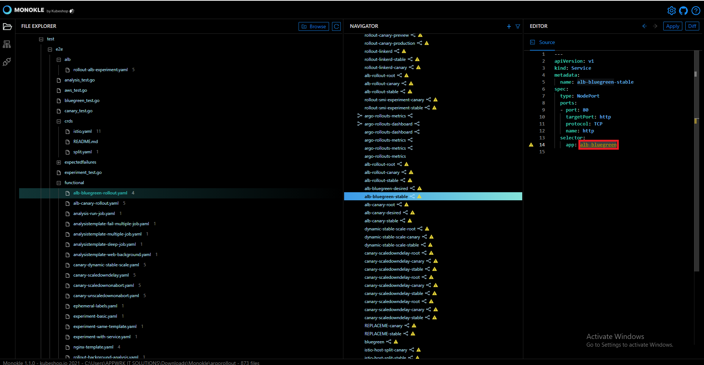

# How to Fix Broken Links

In this Monokle tutorial, we have illustrated the steps to fix broken links. 

Let’s get started. 

## 1. Launch Monokle

Launch Monokle and click on the Browse button to add your project folder containing K8 resources. 

<em>**Note:** Please follow this [Getting Started](../getting-started.md) guide to install Monokle 🚀</em>

## 2. Select Folder

Select your folder to parse its manifest in Monokle’s File Explorer. 

In the file explorer, you can view manifests, including their resources, and their relationships.

## 3. Navigate resource manifests

Scroll up & down to navigate and select the required manifests. 

Once you select a manifest, its related resources shall be highlighted automatically in the navigator. 

## 4. Find broken links

Scroll down in the navigator and hover over a resource link with a warning signal.

<em>**Note:** The link with a warning signal indicates that it’s broken</em>  

## 5. Click on broken link

Click on the link provided in the tooltip.

<em>**Note:**  The source code for the specific resource will be highlighted automatically in the editor.</em> 

## 6. Update the link in the source editor

Manually update the name of the highlighted dead endpoint with a working endpoint to fix dead-end broken links. 

> The warning triangle will automatically go away once a valid link is provided.

Got queries? Please feel free to join our open source community on Discord with this invite link and start your discussion. 

