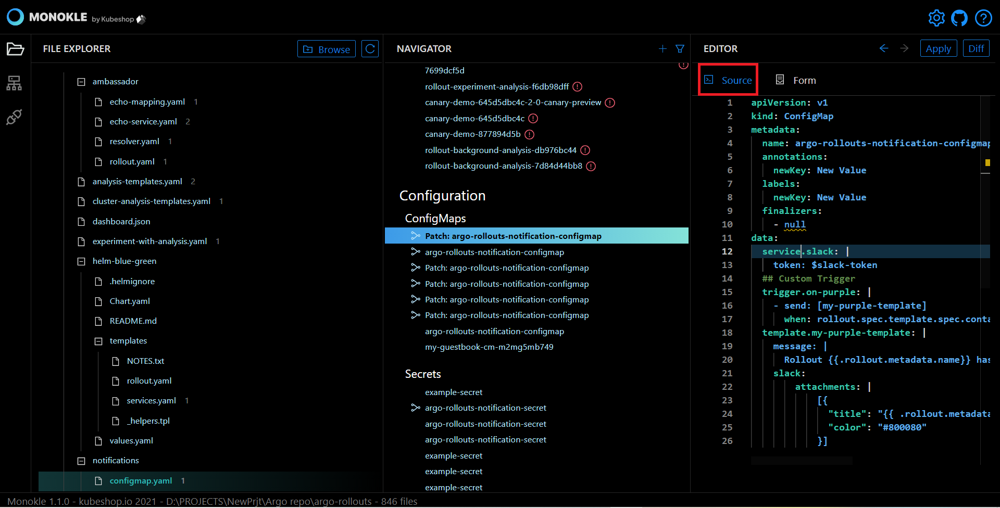
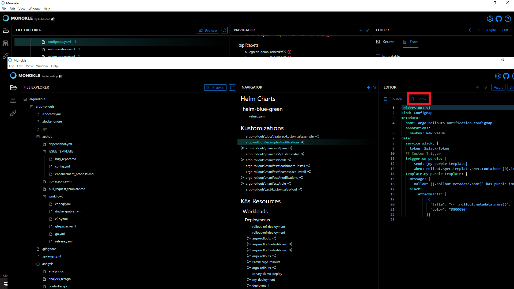

## How to Fix Dead-End Broken Links?

Monokle is a fully integrated IDE for managing manifests. It provides instant access for debugging Kubernetes resources without looking into the YAML syntax. 

In this tutorial, we have illustrated the steps to fix dead-end broken links. 

Let’s get started. 

**Step 1:** Launch Monokle and click on the Browse button to add your project folder containing K8 resources. 

<em>**Note:** Please follow this Getting Started guide to install Monokle 🚀</em>

**Step 2:** Select your folder to parse its manifest in Monokle’s File Explorer. 

In the file explorer, you can view manifests, including their resources, and their relationships.

**Step 3:** Scroll up & down to navigate and select the required manifests. 

Once you select a manifest, its related resources shall be highlighted automatically in the navigator. 

**Step 4:** Select the K8 manifests in the file explorer. 

**Step 5:** Scroll down in the navigator and hover over a resource link with a warning signal.

<em>**Note:** The link with a warning signal indicates that it’s broken and leads to a dead endpoint.</em>  

**Step 6:** Click on the link provided in the tooltip.

<em>**Note:**  The source code for the specific resource will be highlighted automatically in the editor.</em> 

**Step 7:** Manually update the name of the highlighted dead endpoint with a working endpoint to fix dead-end broken links. 

Got queries? Please feel free to join our open source community on Discord with this invite link and start your discussion. 

