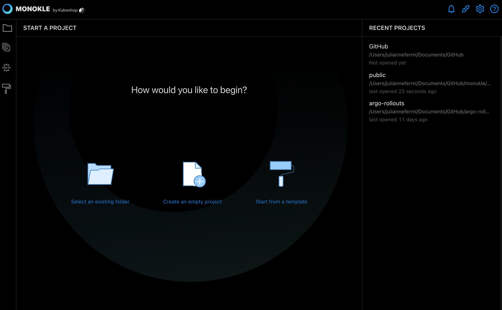
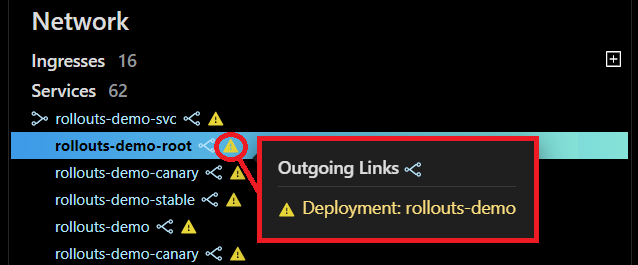
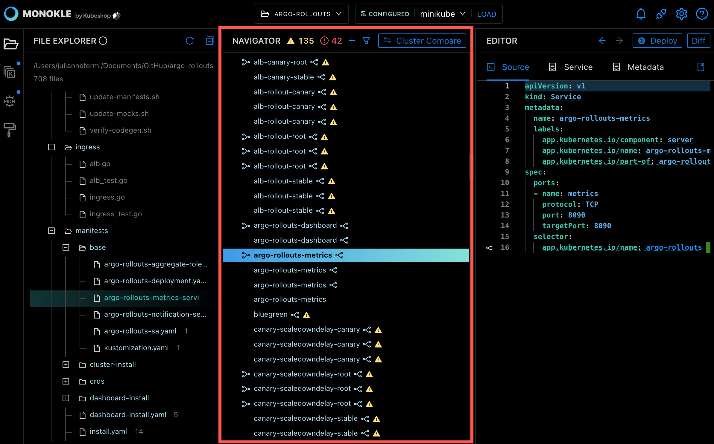
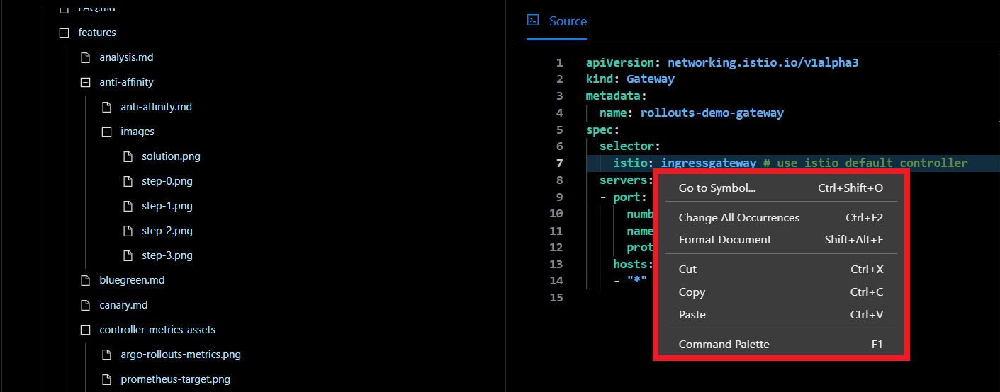

# How to work with Manifests

In this Monokle tutorial, we will illustrate the steps to help you navigate K8s resources and edit their manifests. 

Let’s get started! 

## **1. Launch Monokle**

<em>**Note:** Please follow this [Getting Started](../getting-started.md) guide to install Monokle 🚀</em>

Launch Monokle and, on the welcome screen, there are three option to start working with projects:

 - Select an exisiting folder.
 - Create an empty project.
 - Start from a template.
 
 Click **Select an existing project** to add your project folder containing K8 resources. 

## **2. Select Folder**

Select your folder to parse its manifest in the file explorer. 

In the file explorer, you can view manifests, including their resources, and their relationships.

## **3. Navigate Resource Manifests**

Scroll up & down to navigate and select the required manifests. 

Once you select a manifest, its related resources will be highlighted automatically in the navigator. 

## **4. Navigate Resource Links**

Click on outgoing and incoming links to navigate the corresponding resources. 

 

> The warning triangle reflects that the link refers to broken resource links - see [Resource Links](../resource-navigation.md#resource-links)

 

## **5. Select Required Resource**

Select the required resource in the Navigator. 

  

Once you select a resource, its source code will be launched and highlighted in the editor. 

Now you can edit the resource in the editor and any changes you make will be automatically saved.

> See [Resource Editing](../resource-editing.md) for more information on how to edit resources.

## **6. Edit a Resource**

Right-click on the editor to launch the editing menu.

 

The editing menu includes the following options:

- **Go to Symbols:** Select the Go to Symbol option to perform a focused search of code for finding specified symbols quickly.
- **Change all Occurrences:** Select the Change all Occurrences option to replace all string occurrences in the code with any other regular expression.
- **Format Document:** Select the Format Document option to organize the source code for better readability.  It addresses font size, spacing, margins, alignment, columns, indentation, and lists.
- **Cut:** Select the Cut option to delete the unnecessary data. After you cut the text, it gets stored in the clipboard so you can use it later.
- **Copy:** Select the Copy option to copy a piece of code and reuse the code to save development time.
- **Paste:** Select the Paste option to paste a piece of code. This reduces the repetition of efforts required to write and test code.
- **Command Palette:** Select the Command Palette option to access keyboard shortcuts quickly for the most common operations.

<em>**Note:** The editor provides autocomplete and autosave options.</em>

## **Questions or Comments?** 

Please feel free to join our open source community on Discord with this [Invite Link](https://discord.gg/6zupCZFQbe) and start your discussion.

