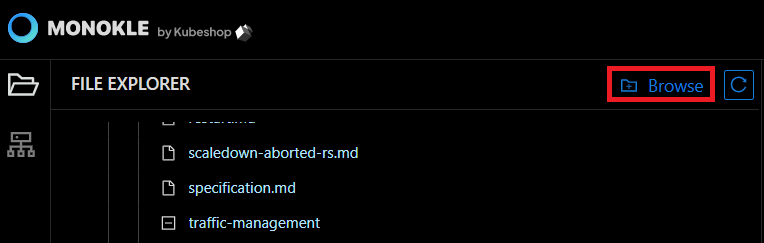
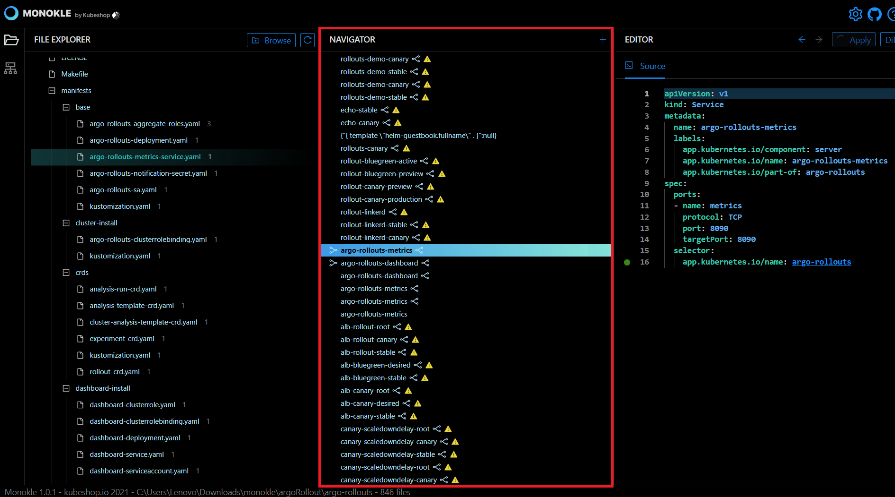

# How to work with Manifests

In this Monokle tutorial, we will illustrate the steps to help you navigate K8s resources and edit their manifests. 

Let’s get started! 

## 1. Launch Monokle

Launch Monokle and click on the Browse button to add your project folder containing K8 resources. 

> Please see [Getting Started](../getting-started.md) for how to install Monokle 🚀

## 2. Select your folder

Select your folder to parse its manifest in the file explorer. 

 

In the file explorer, you can view manifests, including their resources, and their relationships.

> See [Resource Navigation](../resource-navigation.md) for more information on how to navigate resources.

## 3. Navigate manifests

Scroll up & down to navigate and select the required manifests. 

 

Once you select a manifest, its related resources shall be highlighted automatically in the navigator. 

## 4. Navigate resource links

Click on outgoing and incoming links to navigate the corresponding resources. 

 

> The warning triangle reflects that the link refers to broken resource links - see [Resource Links](../resource-navigation.md#resource-links)

 

## 5. Select required resource

Select the required resource in the Navigator. 

  

Once you select a resource, its source code will be launched and highlighted automatically in the editor. 

Now you can edit the resource in the editor, any changes you make will be automatically saved.

> See [Resource Editing](../resource-editing.md) for more information on how to edit resources.

## 6. Editing your resource

Right-click on the editor to launch the editing menu.

 

The editing menu includes the following options:

- **Go to Symbols:** Select the Go to Symbol option to perform a focused search of code for finding specified symbols quickly.
- **Change all occurrences:** Select the Change all Occurrences option to replace all string occurrences in the code with any other regular expression.
- **Format Document:** Select the Format Document option to organize the source code for better readability.  It addresses font size, spacing, margins, alignment, columns, indentation, and lists.
- **Cut:** Select the Cut option to delete the unnecessary data. After you cut the text, it gets stored in the clipboard so you can use it later.
- **Copy:** Select the Copy option to copy a piece of code. Thus you can reuse the code to save development time.
- **Paste:** Select the Paste option to paste a piece of code. It helps in reducing the repetition of efforts required to write and test code.
- **Command Palette:** Select the Command Palette option allows you to access keyboard shortcuts quickly for the most common operations.
- <em>**Note:** Editor provides autocomplete and autosave options.</em>

Thus, you can navigate K8s resources and edit their manifests.

Got queries? Please feel free to join our open source community on Discord with this [invite link](https://discord.gg/6zupCZFQbe) and start your discussion.

