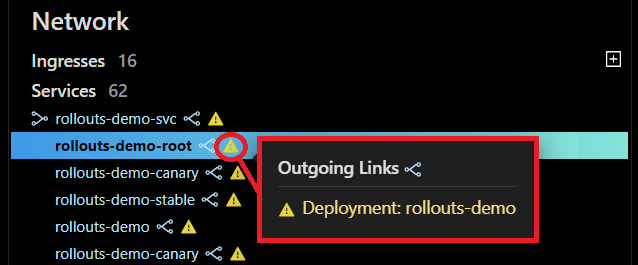

# Navigate and Edit K8s  Manifests

Monokle is a fully integrated IDE for managing manifests. It provides instant access for debugging Kubernetes resources without looking into the YAML syntax. 

In this tutorial, we have illustrated the steps to help you navigate K8s resources and edit their manifests for faster deployment. 

Let’s get started. 

**Step 1:** Launch Monokle and click on the Browse button to add your project folder containing K8 resources. 

<em>**Note:** Please follow this Getting Started guide to install Monokle 🚀</em>

**Step 2:** Select your folder to parse its manifest in the file explorer. 

 

In the file explorer, you can view manifests, including their resources, and their relationships.

**Step 3:** Scroll up & down to navigate and select the required manifests. 

 

Once you select a manifest, its related resources shall be highlighted automatically in the navigator. 

**Step 4:** Click on outgoing and incoming links to navigate the corresponding resources. 

 

<em>**Note:** The warning triangle reflects that the link refers to broken resource links.</em> 

 

**Step 5:** Select the required resource in the Navigator. 

  

Once you select a resource, its source code will be launched and highlighted automatically in the editor. 

Now you can edit the codebase in the editor.

**Step 6:** Right-click on the editor to launch the editing menu.

  

The editing menu includes the following options:

**Go to Symbols:** Select the Go to Symbol option to perform a focused search of code for finding specified symbols quickly. 

**Change all occurrences:** Select the Change all Occurrences option to replace all string occurrences in the code with any other regular expression. 

**Format Document:** Select the Format Document option to organize the source code for better readability.  It addresses font size, spacing, margins, alignment, columns, indentation, and lists. 

**Cut:** Select the Cut option to delete the unnecessary data. After you cut the text, it gets stored in the clipboard so you can use it later. 

**Copy:** Select the Copy option to copy a piece of code. Thus you can reuse the code to save development time. 

**Paste:** Select the Paste option to paste a piece of code. It helps in reducing the repetition of efforts required to write and test code.     

**Command Palette:** Select the Command Palette option allows you to access keyboard shortcuts quickly for the most common operations. 

<em>**Note:** Editor provides autocomplete and autosave options.</em>

Thus, you can navigate K8s resources and edit their manifests.

Got queries? Please feel free to join our open source community on Discord with this [invite link](https://discord.gg/6zupCZFQbe) and start your discussion.

