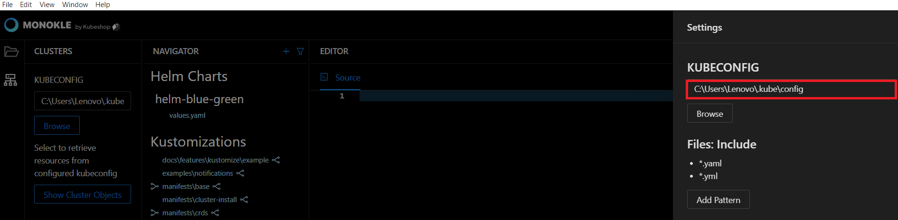
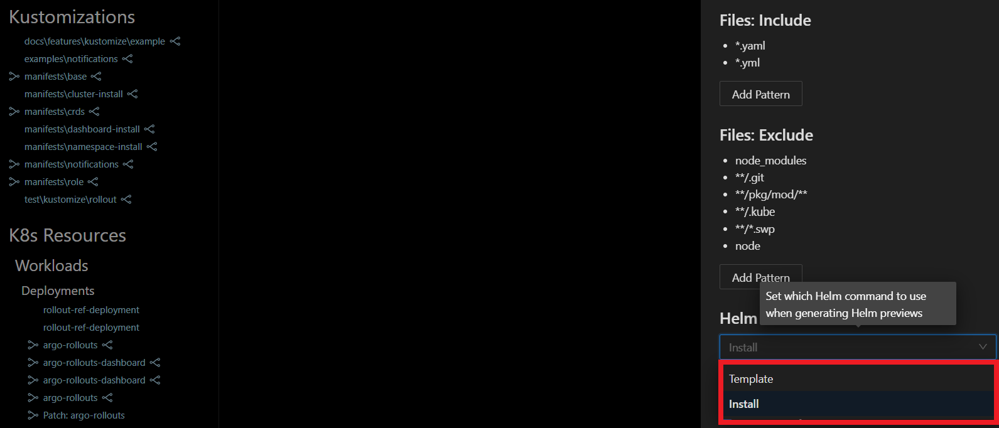
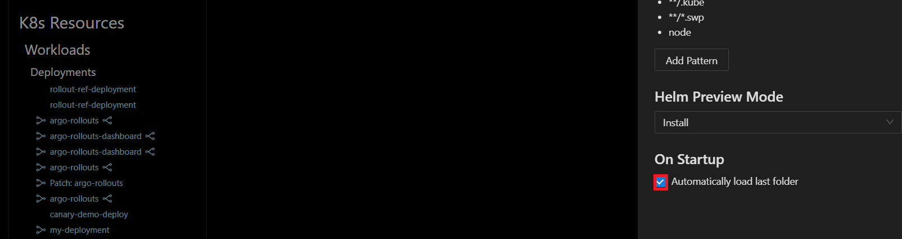

# Preview Monokle Environment Settings

Monokle is a fully integrated IDE for managing manifests. It provides instant access for debugging Kubernetes resources without looking into the yaml syntax. 

In this tutorial, we have illustrated the steps to set up Monokle Environment. 

Let’s get started. 

**Step 1:** Launch Monokle and click on the Settings button to set up the Kubernetes dashboard.

<em>**Note:** Please follow this Getting Started guide to install Monokle 🚀</em>

**Step 2:** Enter the kubeconfig file path in the KUBECONFIG text field. 

Alternatively, you can click on the Browse button to fetch the kubeconfig file for configuring cluster access. 

Select the required folder to config the cluster. 

<em>**Note:** The kubectl command-line tool uses kubeconfig files to find the information for choosing a cluster and communicating with the API server.</em>

**Step 3:** Click on the Add Pattern button to include the files having the corresponding extension. For example .yaml. 

Enter the extension pattern in the files include textbox and hit the OK button. 

**Step 4:** Click on the Add Pattern button to exclude the files having the corresponding extension. For example, node_modules.

Enter the extension pattern in the files exclude textbox and hit the OK button. 

**Step 5:** Click on Helm Preview Mode dropdown to select any of the viewing states. 

The options for preview:

**Template** - To use Helm template
 
**Install -** To use Helm Install

**Step 6:** Tick the Automatically Load Last Folder checkbox to reload the last reviewed folder on launching Monokle. 

Thus you can set up your Monokle environment. 

If you still have doubts, feel free to connect with us. Monokle is your K8s best friend!
