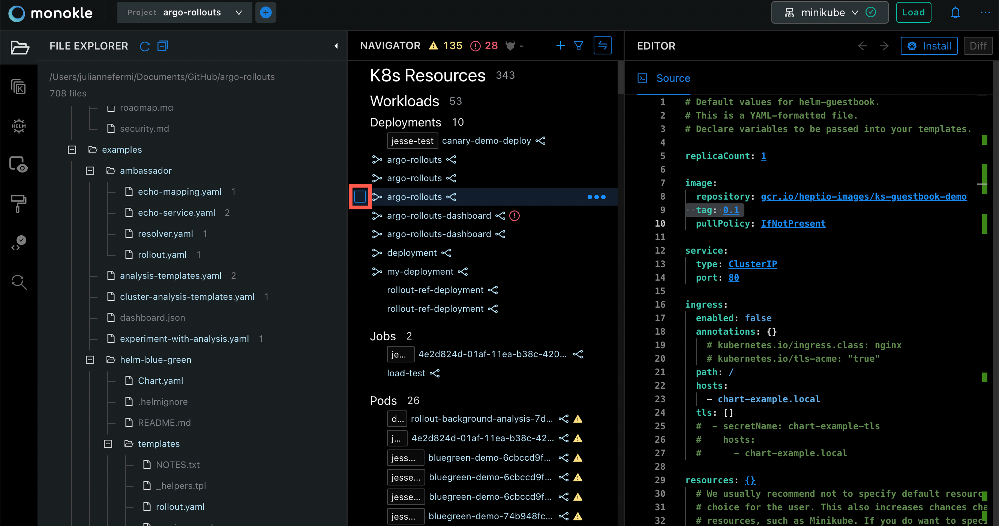
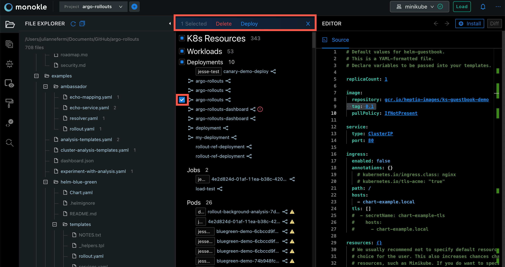

## **Working with Multiple Resources**

In the Navigator, hover over a local resource to display a check box to select one or more resources:

Selecting one or more resources brings up the **Action Links** at the top of the Navigator where the **Delete** and **Deploy** options are available:

This same functionality is available for cluster resources where the **Delete** and **Save to file/folder** are the options:

